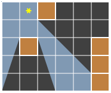

## 문제

크기가 N×M인 직사각형 모양의 방이 있고, 방은 1×1크기의 단위 정사각형으로 나누어져 있다. '.'는 빈 칸, '#'는 벽, '\*'는 광원을 의미한다. 방에 광원은 하나만 있다. 방의 어떤 점과 광원을 일직선으로 이었을 때, 벽에 의해서 가로막히지 않는다면, 그곳에는 빛이 도달할 수 있다. 그 외의 빈 공간과 벽은 모두 그림자이다. 방의 정보가 주어졌을 때, 그림자의 넓이를 구해보자.

예를 들어, 다음과 같이 생긴 방을 보자.

벽이 차지하는 넓이는 5, 빛이 도달하지 못하는 빈 공간의 넓이는 8.5이기 때문에, 이 경우 그림자의 넓이는 13.5이다.

## 입력

첫째 줄에 N과 M이 주어진다. N과 M은 50보다 작거나 같은 자연수이다. 둘째 줄부터 N개의 줄에 방의 모양이 주어진다. ‘.’은 빈칸, ‘#’은 벽, ‘\*’은 광원이다.

## 출력

첫째 줄에 문제의 정답을 출력한다. 절대/상대 오차는 10-9까지 허용한다.
