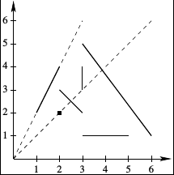

## 문제

재현이는 얼마 전 게임을 만들었다. 게임의 이름은 "유재민"이고, 게임의 주인공은 유재민이다.

유재민은 (0, 0)에서 레이저 빔을 발사하는 역할을 한다. 게임의 목표는, 유재민을 잘 조종해서 좌표평면 상에 있는 선분을 최대한 많이 맞추는 것이다. 유재민은 최대 K번 레이저 빔을 발사할 수 있으며, 레이저 빔이 선분의 끝점을 지나도, 맞췄다는 판정이 난다.

애석하게도, 재현이는 게임을 만들 때 몇 가지 처리를 하지 못했고, 결국 한번 맞췄던 선분을 다시 맞췄을 경우 게임 프로그램이 크래시 되는 버그를 발견했다. 처음에는 당황했지만, 그래도 이런 게임도 나름 재미있을 것 같아서, 재현이는 이 게임을 최적으로 플레이 하려고 한다. 재현이를 도와서, 현재의 제약 조건 상황에서 맞출 수 있는 선분의 최대 개수를 구하자.

## 입력

첫 번째 줄에 k, n이 주어진다. (1 ≤ k ≤ 100, 1 ≤ n ≤ 500 000)

이후 n개의 줄에 선분이 x1, y1, x2, y2 (1 ≤ x1, y1, x2, y2 ≤ 1 000 000)의 형태로 주어진다. (x1, y1)과 (x2, y2)를 잇는다는 뜻이다.

## 출력

한번 맞췄던 선분을 다시 맞추지 않는다는 조건 하에, 최대 K개의 레이저 빔을 쏘아서, 맞출 수 있는 최대 개수의 선분을 출력하라.

## 힌트

