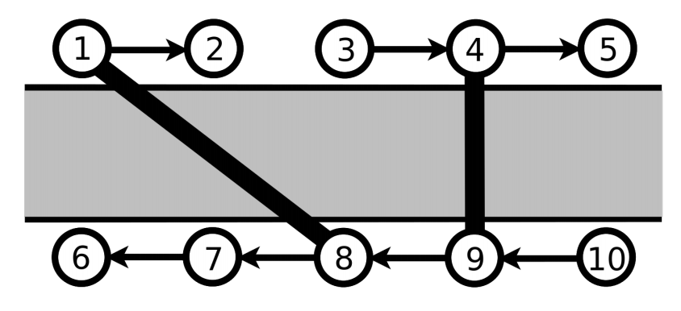

## 문제

There are 2N towns in a certain country and a long river that runs from west to east. There are N towns on each side of the river. On the north side, they are labeled with numbers from 1 to N and on the south with numbers from N + 1 to 2N. The towns on each river bank are labeled in a way that the town further east on the bank always has the greater label.

On the north bank, there is a one-way road from each town (except town N) to its nearest town to the east. On the south bank, there is a one-way road from each town (except town N + 1) to its nearest town to the west.

Figure 1: Figure accompanying the first test case after all the blockings and constructions are done.

Given the fact there is a lot of heavy traffic, the roads can sometimes get run down so they are permanently blocked because of safety reasons. In order to enable connectivity of cities that are not necessarily on the same side of the bank, the people in charge build bridges that directly connect some two cities located on opposite sides of the river. Bridge construction is a financially challenging task so they are built with special attention and they can never be run down. Because of the same reason, the bridges are two-way, unlike cheap roads on the banks of the river. Additionally, the constructed bridges will never intersect, not even in their starting or ending towns – thus, each town will be directly connected by a bridge with at most one town on the other side of the river.

Mirko works at the information office in a leading bus company. Every day hundreds of people come to him and ask whether it is possible to get from one town to another. Mirko then glances on roads that are currently passable and bridges built so far and checks if there is a way to get from one town to another. He likes this job very much, but it overlaps with his daily coffee break from 11 a.m. to 2 p.m. so he asked you to write a program that will do this job for him!

Write a program that will simulate M events given in chronological order. Each event is either an information about a newly blocked road or an information about a newly built bridge or an enquiry from a traveler regarding the existence of a way between two towns. The events are given in the following form:

* ‘A G1 G2’ - a bridge is built between towns G1 and G2.
* ‘B G1 G2’ - a one-way road between towns G1 and G2 is blocked.
* ‘Q G1 G2’ - a traveler wants to know whether there is a way from town G1 to town G2, given the current passable roads and built bridges.

In the beginning, all roads are available and no bridges are built.

## 입력

The first line of input contains integers N (1 ≤ N ≤ 109) and M (1 ≤ M ≤ 200 000), the number of towns on one bank of the river and the number of events.

Each of the following M lines contains the description of a single event in the form described in the task. For town labels in the events, it will hold 1 ≤ G1, G2 ≤ 2N. The towns G1 and G2 will always be different.

You can assume that the road which is being blocked was free up until that moment, and the bridge that is being built didn’t exist up until then.

## 출력

For each traveler enquiry, you must print (in the order they were given) on the standard output ‘DA’ (Croatian word for yes) if there is a way from town G1 to town G2 or print ‘NE’ (Croatian word for no) otherwise.
