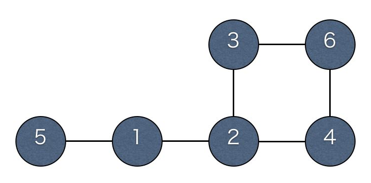

## 문제

IOI 国は町 1 から町 N までの N 個の町からなり，町と町とは道路で結ばれている．IOI 国には K 本の道路があり，すべての道路は異なる 2 つの町を結んでいる．車は道路を双方向に自由に移動できるが，道路以外を通ってある町から別の町に行くことはできない．

IOI 国の町 1 に住む JOI 君は，町 N に住む祖母の家までタクシーで行くことにした．IOI 国にはタクシー会社 1 からタクシー会社 N までの N 個のタクシー会社がある．IOI 国のタクシー会社には次のような少々特殊な規則がある．

* タクシー会社 i のタクシーには，町 i でのみ乗車できる．
* タクシー会社 i のタクシーの運賃は，利用した距離によらず Ci である．
* タクシー会社 i のタクシーは，乗車してから連続して最大 Ri 本の道路しか通ることができない．

たとえば R1 = 2 の場合，町 1 からタクシー会社 1 のタクシーに乗車すると，最大 2 本の道路しか通ることができないため，道路を 3 本以上通るためには途中の町でタクシーを乗り換える必要がある．

JOI 君は町以外の地点でタクシーに乗ったりタクシーから降りたりすることはできない．また，タクシー以外の移動手段を用いることもできない．JOI 君が町 N に到達するために必要な運賃の合計の最小値を求めるプログラムを作成せよ．

## 입력

入力は 1 + N + K 行からなる．

1 行目には，2 つの整数 N, K (2 ≦ N ≦ 5000, N - 1 ≦ K ≦ 10000) が空白を区切りとして書かれている．これは，IOI 国が N 個の町からなることと，IOI 国の道路の本数が K 本であることを表す．

続く N 行のうちの i 行目 (1 ≦ i ≦ N) には，2 つの整数 Ci, Ri (1 ≦ Ci ≦ 10000, 1 ≦ Ri ≦ N) が空白を区切りとして書かれている．これは，タクシー会社 i のタクシーの運賃が Ci で，乗車してから連続して最大 Ri 本の道路しか通ることができないことを表す．

続く K 行のうちの j 行目 (1 ≦ j ≦ K) には，異なる 2 つの整数 Aj, Bj (1 ≦ Aj ＜ Bj ≦ N) が空白を区切りとして書かれている．これは，町 Aj と町 Bj との間に道路が存在することを表す．同じ (Aj, Bj) の組が 2 回以上書かれていることはない．

与えられる入力データにおいては，どの町から別のどの町へもタクシーを乗り継いで行くことができることが保証されている．

## 출력

JOI 君が町 1 から町 N まで行くのに必要な運賃の合計の最小値を表す整数を 1 行で出力せよ．

## 힌트

上の入出力例は，以下の図に対応している．円は町を，線は道路を表す．

この入出力例でJOI 君が最小の運賃で町 6 に到達するには，以下のようにする．

町 1 からタクシーに乗って町 5 に行く． (運賃 400)  
町 5 からタクシーに乗って町 6 に行く． (運賃 300)

JOI 君がこのようなルートを通った場合の運賃の合計は 400 + 300 = 700 であるので，700 を出力する．

※各入出力例のデータは， 右クリック等によりファイルに保存して利用可能です．
