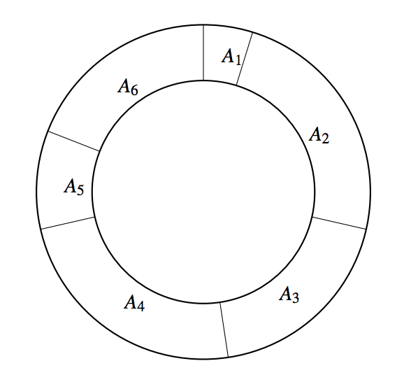

## 문제

JOI 君は妹の JOI 子ちゃんと JOI 美ちゃんと一緒におやつを食べようとしている．今日のおやつは 3 人の大好物のバームクーヘンだ．

バームクーヘンは下図のような円筒形のお菓子である．3 人に分けるために，JOI 君は半径方向に刃を 3回入れて，これを 3 つのピースに切り分けなければならない．ただしこのバームクーヘンは本物の木材のように固いので，刃を入れるのは簡単ではない．そのためこのバームクーヘンにはあらかじめ N 個の切れ込みが入っており，JOI 君は切れ込みのある位置でのみ切ることができる．切れ込みに 1 から N まで時計回りに番号をふったとき，1 ≤ i ≤ N − 1 に対し， i 番目の切れ込みと i + 1 番目の切れ込みの間の部分の大きさは Ai である．また N 番目の切れ込みと 1 番目の切れ込みの間の部分の大きさは AN である．

図 1: バームクーヘンの例 N = 6, A1 = 1, A2 = 5, A3 = 4, A4 = 5, A5 = 2, A6 = 4

妹思いの JOI 君は，バームクーヘンを 3 つのピースに切り分けたあと，自分は最も小さいピースを選び，残りの 2 つのピースを 2 人の妹にあげることにした．一方で，JOI 君はバームクーヘンが大好物なので，できるだけたくさん食べたいと思っている．最も小さいピースの大きさが最大になるように切ったとき，JOI君が食べることになるピースの大きさはいくらになるだろうか．

切れ込みの個数 N と，各部分の大きさを表す整数 A1, . . . , AN が与えられる．バームクーヘンを 3 つに切り分けたときの，最も小さいピースの大きさの最大値を出力するプログラムを作成せよ．

## 입력

標準入力から以下のデータを読み込め．

* 1 行目には，整数 N が書かれている．これはバームクーヘンに N 個の切れ込みがあることを表す．
* 続く N 行のうちの i 行目 (1 ≤ i ≤ N) には，整数 Ai が書かれている．これは i 番目の切れ込みと i + 1番目の切れ込みの間の部分 (i = N のときは N 番目の切れ込みと 1 番目の切れ込みの間の部分) の大きさが Ai であることを表す．

## 출력

標準出力に，バームクーヘンを 3 つに切り分けたときの，最も小さいピースの大きさの最大値を表す整数を 1 行で出力せよ．
