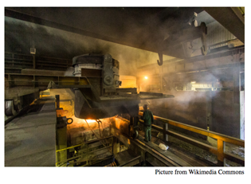

## 문제

Yulia works for a metal processing plant in Ekaterinburg. This plant processes ores mined in the Ural mountains, extracting precious metals such as chalcopyrite, platinum and gold from the ores. Every month the plant receives n shipments of unprocessed ore. Yulia needs to partition these shipments into two groups based on their similarity. Then, each group is sent to one of two ore processing buildings of the plant.

To perform this partitioning, Yulia first calculates a numeric distance d(i, j) for each pair of shipments 1 ≤ i ≤ n and 1 ≤ j ≤ n, where the smaller the distance, the more similar the shipments i and j are. For a subset S ⊆ {1, . . . , n} of shipments, she then defines the disparity D of S as the maximum distance between a pair of shipments in the subset, that is,

\[D(S) = \max \_ {i,j  \in  S} { d(i,j)}\]

Yulia then partitions the shipments into two subsets A and B in such a way that the sum of their disparities D(A) + D(B) is minimized. Your task is to help her find this partitioning.

## 입력

The input consists of a single test case. The first line contains an integer n (1 ≤ n ≤ 200) indicating the number of shipments. The following n − 1 lines contain the distances d(i, j). The ith of these lines contains n − i integers and the jth integer of that line gives the value of d(i, i + j). The distances are symmetric, so d(j, i) = d(i, j), and the distance of a shipment to itself is 0. All distances are integers between 0 and 109 (inclusive).

## 출력

Display the minimum possible sum of disparities for partitioning the shipments into two groups.
