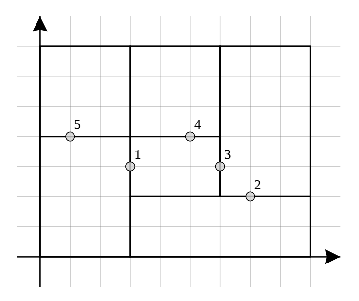

## 문제

Mirko has bought himself a meadow in the coordinate system. The meadow is in the shape of a rectangle A meters wide and B meters high, whose sides are parallel to coordinate axes. The lower left edge of the meadow is located on point (0, 0) and the upper right on point (A, B).

Mirko has decided to build horizontal and vertical fences on his meadow. He does this in the following way: first, he picks a point (X, Y ) through which no fence has passed so far and decides whether the new fence is going to be horizontal or vertical. After that, he builds the fence in the chosen direction until he bumps into another fence and connects them there, then goes back and finishes the other part of the fence in the same way.

Slika 1: The image above shows the meadow’s layout after all the fences have been built from the first test case. The points where Mirko starts building and the order of building is marked.

Notice that this procedure divides the meadow into a certain number of fields, where each field is a rectangle with fences on the sides and without fences in its interior. More specifically, every newly added fence divides an existing field into exactly two new fields.

Write a programme that will, based on the descriptions of fences that are built starting from an empty meadow, after each built fence find the area of the two newly appeared fields. Output the areas of these two fields sorted in ascending order.

## 입력

The first line of input contains two integers A and B (2 ≤ A, B ≤ 105), the width and height of the meadow.

The second line of input contains the integer N (1 ≤ N ≤ 105), the number of fences being built.

Each of the following N lines contains three integers X, Y, D (0 < X < A, 0 < Y < B, D ∈ {1, 2}), coordinates of the point where Mirko starts building the fence and the fence direction. Mirko builds a horizontal fence if D = 1 and a vertical one if D = 2.

Regarding point (X, Y), up until that moment there won’t be a fence passing through it.

## 출력

The output must consist of N lines. For each fence being built, you must output two space-separated integers in a single line, the area of the smaller newly appeared field and the area of the bigger field, respectively.

Please note: The required areas may not fit into the 32-bit integer type. We advise you to use the 64-bit type, for example long long (C/C++) or int64 (Pascal).
