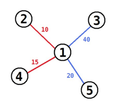

## 문제

요즘 고려대학교에서 가장 유행하는 게임은 "구슬을 꿰어라" 이다. 게임 이름에서 알 수 있듯이 이 게임은 구슬과 실을 이용해서 한다. 실은 총 두 가지 색상이 있고, 빨간색과 파란색이다. 구슬은 1번부터 n번가지 번호가 매겨져 있다. 게임은 구슬 1개를 가지고 시작한다. 이제 다음과 같은 과정을 통해 새로운 구슬을 실을 이용해 추가할 수 있다.

* Append(w, v): 새로운 구슬 w를 이미 가지고 있는 구슬 v에 빨간 실을 이용해 연결한다.
* Insert(w, u, v): 새로운 구슬 w를 이미 빨간 실로 연결된 구슬 u와 v사이에 파란 실 두 개를 이용해 연결한다. 이때, u와 v를 연결하는 빨간 실은 제거해야 한다. 즉, 이미 존재하는 빨간 실 u - v가 새로운 파란 실 두 개 u - w, w - v로 교체된다.

모든 실은 특정 길이를 가진다. 게임이 종료되었을 때, 최종 점수는 구슬을 연결하는 파란 실 길이의 합이다.

게임이 모두 종료된 상태가 주어진다. 상태는 실이 연결하고 있는 두 구슬의 번호와 길이로 이루어져 있으며, 색상은 알 수 없다.

문제에서 주어진 연결 상태를 만드는 방법은 여러 가지가 있다. 이때, 모든 방법 중에서 가장 큰 최종 점수를 구하는 프로그램을 작성하시오.

## 입력

첫째 줄에 구슬의 수 n이 주어진다. (1 ≤ n ≤ 200000) 구슬은 1번부터 n번가지 번호가 매겨져 있다. 다음 n-1개 줄에는 실의 정보 ai, bi, ci가 주어진다. (1 ≤ ai < bi ≤ n, 1 ≤ ci ≤ 10000) ai와 bi는 실이 연결하는 구슬의 번호이고, ci는 길이이다.

## 출력

가능한 점수 중에서 가장 큰 최종 점수를 출력한다.

## 힌트

예제의 경우에 아래와 같이 연결하면, 60점을 얻을 수 있다. 시작은 3번 구슬로 시작한다.

* 5와 3을 연결한다. (선의 길이는 상관없다)
* 1을 3-5 사이에 넣는다. (길이 40, 20 선을 이용)
* 2와 1을 길이가 10인 선을 이용해 연결한다.
* 4와 1을 길이가 15인 선으로 연결한다.

연결은 아래와 같아지고, 이 방법보다 더 큰 점수를 얻을 수 있는 방법은 없다.

