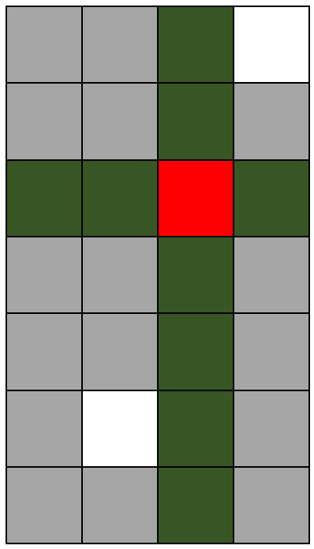

## 문제

As you know Spain won’t defend World Cup champion title, but they already started to train for Euro 2016. One of their best players is Andres Iniesta. As you know, midfielders should have perfect pass and they have to move on the field in such a way that their field of view is maximized.

Spain’s coach, Vicente del Bosque, invented a new training drill for midfielders. The training field is represented by a N×M matrix with obstacles positioned on some cells. Player can stand on any cell in the matrix that doesn’t contain obstacle and player’s field of view is calculated by the number of cells he can see. If the player stands on a cell then he can see another cell if those cells are located at the same row or same column and there is no obstacle between cells (including those cells). Iniesta can see a cell on which he is standing.

As you know, Iniesta has a perfect pass, so he can destroy any obstacle by shooting a ball at it from any position.

Vicente gives K balls to Iniesta, so he can destroy up to K obstacles. After destroying obstacles his job is to find a cell on which his field of view is maximized.

Iniesta lost the focus after Spain lost versus Netherland by 5 − 1 at the start of World Cup, so he asks you for help. Your job is calculate what is the maximum field of view if Iniesta can destroy up to K obstacles and after destroying he can stand on any cell that doesn’t contain obstacle.

## 입력

First line of input contains numbers N, M and K, that represent number of rows, number of columns in the matrix and the number of balls that are given to Iniesta, respectively. Each of the following N lines contains M characters representing a training field in a form of a matrix. Cell located at row r and column c equals '\*' if there is an obstacle at row r and cell c on the field. Cell that doesn’t contain obstacle is represented in the matrix by a character '.'.

## 출력

In the first line of output you should print what is the maximum field of view after destroying up to K obstacles and standing on a cell that doesn’t contain obstacle. Iniesta can stand on a cell if it was empty at beginning or if an obstacle is destroyed on that cell.

## 힌트

After destroying obstacles at positions {(1,3), (3,3), (5,3), (6,3), (7,3)} in matrix (rows and columns indexed from 1), Iniesta should stand at the cell (3,3) in the matrix, and he can see 10 cells as it is shown in the Figure 1.

Figure 1

Red cell represents where Iniesta should stand after destroying obstacles. Green cells represent cells that Iniesta can see. Grey cells are cells with obstacles. White cells are empty cells that Iniesta can’t see from his position.
