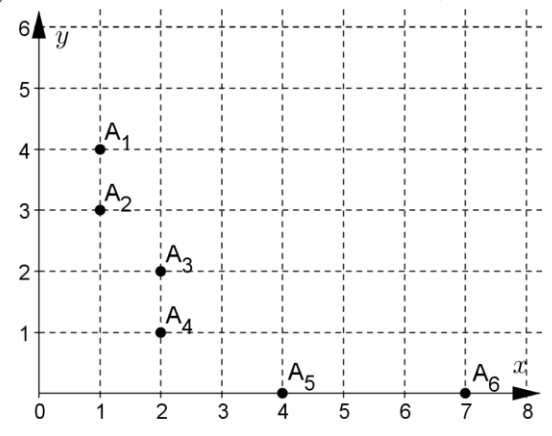

## 문제

Let A1 (x1, y1), A2 (x2, y2), ..., An (xn, yn) be a sequence of n different points in the plane with nonnegative integer coordinates. We call this sequence decreasing if for any two points Ai (xi, yi) and Ai+1 (xi+1, yi+1), it is true that xi ≤ xi+1 and yi ≥ yi+1. For example, the sequence of points A1 (1, 4), A2 (1, 3), A3 (2, 2), A4 (2, 1), A5 (4, 0), A6 (7, 0) is decreasing.

Write program points, which calculates the number of decreasing sequences of points for which x1 + y1 = a1, x2 + y2 = a2, ..., xn + yn = an.

## 입력

The positive integer n is given on the first line of the standard input. There are n nonnegative integers on the second line: a1, a2, ..., an.

## 출력

On a line of the standard output the program has to write by modulo 123456789 the number of the above described sequences.
