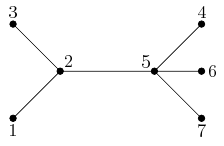

## 문제

There are n towns in Byteotia, connected with only n-1 roads. Each road directly links two towns. All the roads have the same length and are two way. It is known that every town can be reached from every other town via a route consisting of one or more (direct-link) roads. In other words, the road network forms a tree.

Byteasar, the king of Byteotia, wants three luxury hotels erected to attract tourists from all over the world. The king desires that the hotels be in different towns and at the same distance one from each other.

Help the king out by writing a program that determines the number of possible locations of the hotel triplet in Byteotia.

## 입력

The first line of the standard input contains a single integer n(1 ≤ n ≤ 5,000), the number of towns in Byteotia. The towns are numbered from 1 to n.

The Byteotian road network is then described in n-1 lines. Each line contains two integers a and b (1 ≤ a ≤ b ≤ n) , separated by a single space, that indicate there is a direct road between the towns a and b.

## 출력

The first and only line of the standard output should contain a single integer equal to the number of possible placements of the hotels.

## 힌트

The triplets (unordered) of towns where the hotels can be erected are: {1,3,5}, {2,4,6}, {2,4,7}, {2,6,7}, {4,6,7}.
