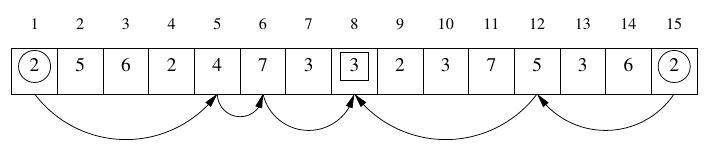

## 문제

Byteburg is a beautiful town by a river. There are n houses along the river, numbered downstream with successive integers from 1 to n. Byteburg used to be a nice quiet town in which everyone was happy. Alas, this changed recently, as two dangerous criminals - Bitie and Bytie set up shop in it. They did so many robberies already that the citizens are afraid to leave their houses.

Bitie and Bytie do no mere burglaries but rather whole raids: each time they leave their houses and walk towards each other, never turning back. Bitie walks downstream (towards larger numbers) while Bytie walks upstream (towards smaller numbers). Along the way, before they meet, each chooses several houses to break into and steal precious items (and vital data). After the robberies they meet in a house and divide their loot. Byteburgers are sick of this already - they would all rather have their tranquility restored. So they asked the detective Bythony for help.

The detective established that the bandits live in houses of the same color but he does not know which one. Just a moment ago, an anonymous tip claimed that the robbers are on a raid. Fearing for their own safety, the source did not say which houses will be broken into. They did however specify their colors. As it turns out, the bandits are quite superstitious - each of them will rob a house of each color at most once.

Bythony can wait no longer. He intends to ambush the criminals at their meeting place. Aid Bythony in his undertaking by writing a program to find all possible meeting places of the robbers.

## 입력

There are two integers in the first line of the standard input, n and k(3 ≤ n ≤ 1,000,000, 1 ≤ k ≤ 1,000,000, k ≤ n), separated by a single space, that specify the number of houses and the number of house colors in Byteburg respectively. The colors are number with successive integers from 1 to k. In the second line of input, there is a sequence of n integers, c1,c2,…,cn(1 ≤ ci ≤ k), separated by single spaces. These are the colors of successive houses in Byteburg.

In the third line of input, there are two integers m and l(1 ≤ m,l ≤ n, m+l ≤ n-1), separated by a single space, specifying the numbers of houses (to be) broken into by Bitie and Bytie respectively. In the fourth line of input, there are m pairwise different integers x1,x2,…,xm(1 ≤ xi ≤ k), separated by single spaces. These are the colors of houses robbed by Bitie in the order of being broken into (i.e., excluding Bitie's house). In the fifth, which is the last, line of input, there are l pairwise different integers  y1,y2,…,yl(1 ≤ yi ≤ k), separated by single spaces. These are the colors of houses robbed by Bytie in the order of being broken into (again, these do not include Bytie's house). Moreover, xm=yl is the color of the house in which the robbers will divide the plunder. (Clearly, they have to break into that one as well!)

## 출력

Your program it to print exactly two lines to the standard output. The first of those should give the number of houses in which the criminals can meet while respecting aforementioned constraints. The second line should contain the increasing sequence of the numbers of those houses, separated by single spaces. If the robbers cannot meet at all, the first line should contain the number 0 while the second one should be empty.

## 힌트

In above example, the bandits may live in houses of color 2(Bitie in the house no. 1 or 4, Bytie in the house no. 15) or 6(Bitie in the house no. 3, Bytie in the house no. 14). Whether he lived in the house no. 1 or 4, Bitie could rob the following houses: 5 (of color 4), 6 (of color 7), and then either 7, 8 or 10 (of color 3). Bitie could rob the following houses: 12 (of color 5), meeting Bitie afterwards in either of 7, 8 or 10 (of color 3). The figure above depicts a scenario in which Bitie lives in the house no. 1 and the robbers meet in the house no. 8.

————  
Sample grading tests:

* 1ocen: n=7, k=3, m=2, l=3, loot can be split in a unique house;
* 2ocen: n=10, k=3, m=3, l=2, bandits cannot meet;
* 3ocen: n=1,000, k=1, m=1, l=1, all houses of same color;
* 4ocen: n=1,000,000, k=1,000, m=l=100, sequence of houses consists of 1,000 identical segments of 1,000 houses of successive colors from 1 to 1,000; the sequence of colors of houses broken into is 1,2,3,…,100 for each robber.
