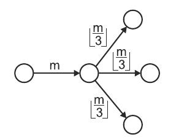
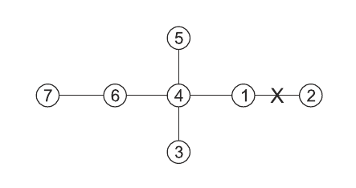

## 문제

The ants are scavenging an abandoned ant hill in search of food. The ant hill has n chambers and n-1 corridors connecting them. We know that each chamber can be reached via a unique path from every other chamber. In other words, the chambers and the corridors form a tree.

There is an entrance to the ant hill in every chamber with only one corridor leading into (or out of) it. At each entry, there are g groups of m1,m2,…,mg ants respectively. These groups will enter the ant hill one after another, each successive group entering once there are no ants inside. Inside the hill, the ants explore it in the following way:

* Upon entering a chamber with d outgoing corridors yet unexplored by the group, the group divides into d groups of equal size. Each newly created group follows one of the d corridors. If d=0, then the group exits the ant hill.
* If the ants cannot divide into equal groups, then the stronger ants eat the weaker until a perfect division is possible. Note that such a division is always possible since eventually the number of ants drops down to zero. Nothing can stop the ants from allowing divisibility - in particular, an ant can eat itself, and the last one remaining will do so if the group is smaller than d.

The following figure depicts m ants upon entering a chamber with three outgoing unexplored corridors, dividing themselves into three (equal) groups of [m/3] ants each.

A hungry anteater dug into one of the corridors and can now eat all the ants passing through it. However, just like the ants, the anteater is very picky when it comes to numbers. It will devour a passing group if and only if it consists of exactly k ants. We want to know how many ants the anteater will eat.

## 입력

The first line of the standard input contains three integers n, g, k(2 ≤ n,g ≤ 1,000,000, 1 ≤ k ≤ 109), separated by single spaces. These specify the number of chambers, the number of ant groups and the number of ants the anteater devours at once. The chambers are numbered from 1 to n.

The second line contains g integers m1,m2,…,mg(1 ≤ mi ≤ 109), separated by single spaces, where mi gives the number of ants in the i-th group at every entrance to the ant hill. The  n-1 lines that follow describe the corridors within the ant hill; the i-th such line contains two integers ai, bi(1 ≤ ai,bi ≤ n), separated by a single space, that indicate that the chambers no.  and  are linked by a corridor. The anteater has dug into the corridor that appears first on input.

In tests worth 50% of the total score, the total number of groups of ants entering the ant hill does not exceed 1,000,000. Moreover, in their subset worth 20% of the total score, it additionally holds that n,g ≤ 100.

## 출력

Your program should print to the standard output a single line containing a single integer: the number of ants eaten by the anteater.  

## 힌트

Next to each of the chambers no. 2, 3, 5, and 7, there are 5 groups of ants. The anteater will eat 3 ants from the first group that starts its exploration at chamber no. 2 and 3 ants from both the fourth and the fifth group that start their exploration at the chamber no. 3, 5, or 7.
