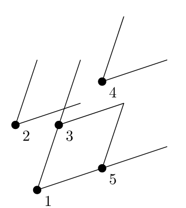

## 문제

Byteasar has a large and pretty garden. As he would like to be able to appreciate its beauty even after dusk, he installed lamps across the garden.

The lamps are directional, i.e., they illuminate only a certain angle, common to them all. Moreover, Byteasar has aligned them so that they all face the same direction. Last but not least, these are solar lamps, i.e., they come with solar panels but no batteries, strangely enough! You might think the panels are thus useless, and each lamp will require electricity at night, but not quite: A lamp will produce light if a sufficient number of lamps illuminate it.

By now, Byteasar has even come up with an order he is going supply the lamps with electricity, thus turning them on. For simplicity, we number the lamps from 1 to  in this order, i.e., the lamp no.  is supplied with electricity at time . The only thing left for Byteasar (and you, of course!) is to figure out when exactly each lamp will start emitting light. Help Byteasar by writing a program that will determine the answer to this question.

## 입력

The first line of the standard input contains a single integer n(1 ≤ n ≤ 200,000): the number of lamps Byteasar installed. In the second line of input, there are four integers X1,Y1,X2,Y2(-109 ≤ Xi,Yi ≤ 109, (Xi,Yi)≠(0,0)), separated by single spaces, that describe the area illuminated by every lamp. Namely, if there is a lamp located at the point (x,y), then it illuminates the area (together with its edge) within the smaller of the two angles formed by two rays that both originate at (x,y) such that the i-th (for i=1,2) ray passes through (x+Xi, y+Yi). This angle is always smaller than 180 degrees.

The n input lines that follow specify the locations of the lamps: the i-th such line contains two integers xi,yi, (-109 ≤ xi,yi ≤ 109) separated by a single space, that indicate that the lamp no. i is located at the point (xi,yi). You may assume that no two lamps share their location.

The last line of the input contains n integers k1,k2,…,kn(1 ≤ ki ≤ n), separated by single spaces, that signify that if the lamp no. i is in the area illuminated by at least ki other lamps, then it will start emitting light as well.

In tests worth 30% of the total score, it holds that n ≤ 1,000.

## 출력

Your program should print out to the standard output a single line with n integers t1,…,tn, separated by single spaces. The number ti should be the time when the lamp no. i starts producing light.

## 힌트

At time 1 Byteasar powers on the lamp 1, which also causes the lamp 3 to produce light. Once the lamp 2 is powered on, the lamp 4 begins to emit light (being illuminated by lamps 1, 2, and 3).
