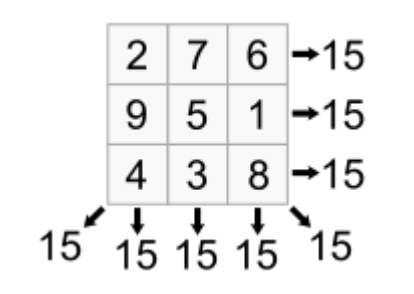

## 문제

A magic square is an arrangement of integers in a square grid, where the numbers in each row, and in each column, and the numbers on each main diagonal, all add up to the same value. A magic square has the same number of rows and columns and we will let m represent the size (number of rows and columns) of the magic square. Thus, a magic square of size m will have a total of m2 integers. The following is a magic square with m=3.

You will write a program that will determine if an mxm square is a magic square.

## 입력

The first line of input will be a positive integer, n, indicating the number of problem sets (i.e., magic squares) to follow. Each problem set starts with the integer, m, that specifies the size of the magic square. The next m lines each contain m integers and the integers are separated by one or more spaces.

## 출력

For each problem set if the square is a magic square print “Magic square of size <m>”, where <m> is replaced with the size (number of rows) of the magic square. If the square is not a magic square print “Not a magic square”
