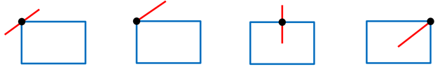
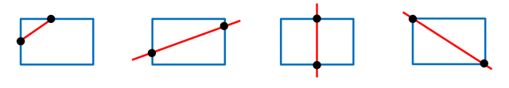

## 문제

이제 사각형의 경계선과 선분의 교차점에 관한 간단한 기하 문제를 풀어볼 것이다.

매우 다행히도 사각형은 항상 축에 평행한 형태로만 놓여 있다.

어떤 사각형과 어떤 선분의 교차점은 항상 0개이거나, 1개이거나, 2개이거나, 무한하다.

각각의 경우에 대한 몇 가지 예제는 아래와 같다.

(a) 교점이 0개인 경우

(b) 교점이 1개인 경우

(c) 교점이 2개인 경우

(d) 교점이 무한히 많은 경우

## 입력

첫 줄에 테스트 케이스의 수 T가 주어진다.

각 테스트 케이스는 4개의 정수로 시작한다. 각 정수는 xmin, ymin, xmax, ymax이며, 이것은 사각형의 왼쪽 아래 꼭짓점이 (xmin, ymin)이고 오른쪽 위 꼭짓점이 (xmax, ymax)임을 의미한다. (-10,000 ≤ xmin < xmax ≤ 10,000, -10,000 ≤ ymin < ymax ≤ 10,000) 그 다음 줄에도 4개의 정수 x1, y1, x2, y2가 주어진다. 이는 선분의 한쪽 끝점이 (x1,y1)이며 다른쪽 끝점이 (x2,y2)임을 의미한다. (-10,000 ≤ x1, y1, x2, y2 ≤ 10,000)

선분의 길이는 항상 0보다 크다.

## 출력

테스트 케이스마다 하나의 정수를 출력한다.

만일 주어진 사각형과 선분의 교차점의 개수가 유한하다면 교차점의 개수를 출력하고, 교차점이 무한히 많다면 4를 출력한다.
