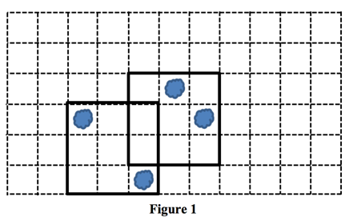

## 문제

추석 연휴를 맞아 홍준이는 자신의 집에서 파티를 열었다. 파티에는 어린 아이들도 많이 왔다. 다음 날 홍준이는 자신의 침대에 여러 얼룩들이 있는 것을 보았다. 그 얼룩들은 침대 시트 밑의 매트릭스까지 스며들었다. 매트릭스 전체를 청소하는 비용이 매우 비싼 관계로 홍준이는 작은 매트릭스 청소 도구를 구매하려한다.

매트릭스의 윗 면은 M × N 크기의 직사각형 격자로 볼 수 있다. 즉, 매트릭스의 수직 성분 개수는 M 개이며 수평 선분 개수는 N 개다. 매트릭스의 각 격자를 좌표로 나타낼 수 있는데, 매트릭스의 왼쪽-위 격자의 좌표는 (1, 1)이며, 오른쪽-아래 격자의 좌표는 (m, n)이다. 한 얼룩은 격자 하나를 덮는다.

홍준이가 구매하려는 매트릭스 청소 도구는 연속하고 직사각형 변에 평행한 3 × 3 영역에 있는 모든 얼룩을 지워주는 도구다. 도구는 하나 사면 한 번만 얼룩을 지울 수 있는 소비성이 있는 도구다. 홍준이를 위해 매트릭스 크기와 얼룩에 대한 정보가 주어졌을 때, 필요한 청소 도구의 최소 개수를 구하자.

<그림 1>은 가능한 상황의 한 예다. 매트릭스의 크기는 6 × 11이며, 각 얼룩의 위치 좌표는 (4, 3), (6, 5), (3, 6)과 (4,7)이다. 위와 같은 경우에 필요한 청소 도구의 최소 개수는 2개다.

## 입력

입력은 여러 개의 테스트케이스로 구성되어 있다.

각 테스트케이스의 첫 줄에는 매트릭스의 크기를 나타내는 두 자연수 m과 n이 주어진다. (3 ≤ m ≤ 10, 3 ≤ n ≤ 1,000). 둘째 줄에는 얼룩의 개수를 나타내는 정수 c가 주어진다. (0 ≤ c ≤ mn) 그리고 다음 c개의 줄에 각 얼룩의 좌표가 주어진다. 얼룩의 좌표는 서로 다르게 주어지며, 모두 매트릭스 위에 위치한다.

## 출력

각 테스트케이스 별로 얼룩을 모두 지우기 위해 필요한 청소 도구의 최소 개수를 의미하는 하나의 정수를 출력한다.
