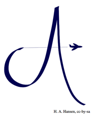

## 문제

AMANDA AIR has routes between many different airports, and has asked their most important frequent flyers, members of the AA Frequent Flyer program, which routes they most often fly. Based on this survey, Amanda, the CEO and owner, has concluded that AMANDA AIR will place lounges at some of the airports at which they operate.

However, since there are so many routes going between a wide variety of airports, she has hired you to determine how many lounges she needs to build, if at all possible, given the constraints set by her. This calculation is to be provided by you, before any lounges are built. Her requirements specifies that for some routes, there must be lounges at both airports, for other routes, there must be lounges at exactly one of the airports, and for some routes, there will be no lounges at the airports.

She is very economically minded and is demanding the absolute minimum number of lounges to be built.

## 입력

The first line contains two non-negative integers 1 ≤ n, m ≤ 200 000, giving the number of airports and routes in the Amanda Catalog respectively. Thereafter follow m lines, each describing a route by three non-negative integers 1 ≤ a, b ≤ n and c ∈ {0, 1, 2}, where a and b are the airports the route connects and c is the number of lounges.

No route connects any airport with itself, and for any two airports at most one requirement for that route is given. As one would expect, 0 is a request for no lounge, 1 for a lounge at exactly one of the two airports and 2 for lounges at both airports.

## 출력

If it is possible to satisfy the requirements, give the minimum number of lounges necessary to do so. If it is not possible, output impossible.
