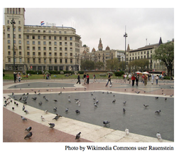

## 문제

Last weekend you and your friends went to visit the local farmer’s market at the town square. As you were standing around in a circle talking, you couldn’t help overhearing two of your friends musing over what sounded like an interesting problem: They were considering the number of ways in which you could all shake hands, such that everyone in the circle simultaneously shaked hands with one other person, but where no arms crossed each other.

After a few seconds’ thought you decided to join your two friends, to share (with them) the solution to their problem. “If we are \(2n\) persons”, you said, “pick any particular person, and let that person shake hands with somebody. That person will have to leave an even number of people on each side of the person with whom he/she shakes hands. Of the remaining \(n-1\) pairs of people, he/she can leave zero on the right and \(n-1\) pairs on the left, \(1\) on the right and \(n−2\) pairs on the left, and so on. The pairs remaining on the right and left can independently choose any of the possible non-crossing handshake patterns, so the count \(C\_n\) for \(n\) pairs of people is given by:

\[C\_n = C\_{n−1}C\_0 + C\_{n−2}C\_1 + \dots + C\_1C\_{n−2} + C\_0C\_{n−1}\]

which, together with the fact that \(C\_0 = C\_1 = 1\), is just the definition of the Catalan numbers.” By consulting your handy combinatorics book, you find out that there is a much more efficient formula for calculating \(C\_n\), namely:

\[C\_n = \frac{\begin{pmatrix} 2n \\ n \end{pmatrix}}{n+1}\]

After a collective groan from the group, your particularly cheeky friend Val called out “Well, since we are at the town square, why don’t you try to square your Catalan numbers!”. This was met with much rejoicing, while you started to think about how to square the Catalan sequence...

Let \(C\_n\) be the \(n\)th Catalan number as defined above. By regarding the sequence \((C\_n)\_{n \ge 0}\) of Catalan numbers, we can define a sequence (Sn)n≥0, corresponding to “squaring the Catalan sequence”, by considering the Cauchy product, or discrete convolution, of \((C\_n)\_{n \ge 0}\) with itself, i.e.,

\[S\_n = \sum\_{k=0}^{n}{C\_kC\_{n-k}}\]

Your task is to write a program for calculating the number \(S\_n\).1

1To see why \((S\_n)\_{n \ge 0}\) could be said to correspond to the square of the Catalan sequence we could look at Cauchy products of power series. Suppose that \(p(x) = \sum\_{n=0}^{\infty } {a\_nx^n}\) and \(q(x) = \sum\_{n=0}^{\infty }{b\_nx^n}\), then \(p(x) \cdot q(x) = \sum\_{n=0}^{\infty }{c\_nx^n}\) where \(c\_n = \sum\_{k=0}^{n}{a\_kb\_{n-k}}\).

## 입력

The input contains one line containing one non-negative integer: \(n\), with 0 ≤ \(n\) ≤ 5 000.

## 출력

Output a line containing \(S\_n\).
