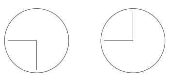

## 문제

상근이는 보통의 시계와는 다른 독특한 시계 사진 두장이 있습니다. 시계는 n개의 동일한 길이와 목적을 가진 시계 바늘들을 가지고 있습니다. 애석하게도 시계의 숫자들은 희미해져 각 시계 바늘들의 위치만 구분 할 수 있습니다.

우리의 상근이는 두 사진의 시계가 같은 시각을 나타낼 수 있는지 궁금해져 각 사진을 서로 다른 각도로 돌려보려고 합니다.

두 사진에 대한 묘사가 주어질 때, 두 사진의 시계가 같은 시각을 나타내는지 결정하세요.

## 입력

첫 줄에는 바늘의 수를 나타내는 정수 n(2 ≤ n ≤ 200 000)이 주어진다.

다음 두 줄에는 각각 n개의 정수가 주어지며, 주어지는 정수 ai(0 ≤ ai < 360,000)는 각 사진에서 바늘의 시계 방향 각도를 나타낸다. 이때 바늘의 각도는 특정 순서대로 주어지지는 않는다. 한 줄에는 같은 각도값이 두 번 이상 주어지지 않는다. 즉, 한 시계 안의 모든 각도값은 서로 구분된다.

## 출력

두 시계 사진이 같은 시각을 나타내고 있다면 "possible"을 아니면 "impossible"을 출력하시오.

## 힌트

그림 H.1: 예제 입력 2
