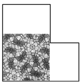

## 문제

The museum of Bizarre Argentinean Pocket Calculators (BAPC) has found a great painter to make a nice floor painting for in the museum. All walls in the museum are straight, and any two adjacent walls meet at a right angle. All non-adjacent walls are pairwise disjoint. Furthermore, the room in which the painting is supposed to come has no pillars. Hence, it is a rectilinear simple polygon.

The design for the painting is square. The museum wants the painting to be as large as possible. Furthermore, it should be placed such that the edges of the square are parallel to the walls. Find the maximum possible width for the painting.

## 입력

On the first line one positive number: the number of test cases, at most 100. After that per test case:

* one line with a single integer n (4 ≤ n ≤ 1 000): the number of corners in the room.
* n lines, each with two space-separated integers x and y (0 ≤ x, y ≤ 100 000): the coordinates of each corner of the room.

The corners are given in clockwise order.

## 출력

Per test case:

* one line with a single integer: the maximum width of a square painting that fits on the floor of the museum.

## 힌트

Floor plan of the first sample input with a 5 × 5 painting.
