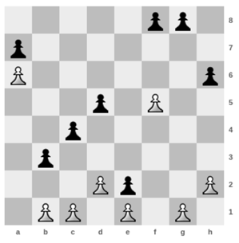

## 문제

Carl and Nathan are completely bored with the game of chess; it’s too easy! They have come up with their own game, which is surely a greater test of one’s intelligence.

This game is played on a board with n by m squares. At the start, white and black pawns are placed quasi-randomly over the board, with the following constraint: in every column there is one white pawn and one black pawn, with the white pawn on some square below the black one.

Each player in turn makes a move with one of his pawns. A pawn is only allowed to move one square forward, provided that this square is empty. “Forward” means in the direction of the opponent, so white pawns move up and black pawns move down. In addition, a pawn on the first rank – that is, a white pawn on the bottom row, or a black pawn on the top row – may also move two squares forward, provided that both squares are empty. Unlike normal chess, the pawns are never taken from the board and never change column.

For example, in the position above, White (the player using the white pieces) has eight moves: one with each of the pawns on b1, d2, f5 and h2, and two with both the pawn on c1 and the pawn on g1. The pawns on a6 and e1 cannot move.

Eventually and inevitably, the pawns will meet up in every column, leaving neither player able to move. The game is then finished, and the winner is the player who made the last move.

As usual, White gets the first move. With optimal play, who would win for a given starting position?

## 입력

On the first line one positive number: the number of test cases, at most 100. After that per test case:

* one line with two space-separated integers n and m (3 ≤ n ≤ 20 and 1 ≤ m ≤ 20): the number of rows and columns of the board, respectively.
* n lines with m characters, describing the position on the board at the start of the game:
  + ‘W’ is a white pawn.
  + ‘B’ is a black pawn.
  + ‘.’ is an empty square.
  + Each column contains exactly one ‘W’ and one ‘B’, with the ‘W’ being below the ‘B’.

In every test case, the starting position will be such that White has at least one move.

## 출력

Per test case:

* one line with the string “White wins” if White can win with optimal play, or “Black wins” if Black has a winning strategy.
