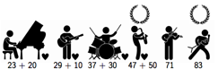

## 문제

You find yourself in the jury of a talent show. In the first round, people from all over the country come around to show you their skills. Only a certain number of people can be allowed to advance to the next round.

Now that all candidates have been seen, it is time to select the people who will advance. Every jury member has some favourites they want to put forward. After a lot of discussion, it is clear that no consensus will be reached this way. They decide to let every jury member award points to a certain number of candidates. The points are all added up and the candidates with the most points advance.

You have your own list of favourites, of whom you would like to let as many as possible advance. Fortunately, from the discussion, it is quite obvious how all the other jury members are going to divide their points. Points are assigned using stickers. Each sticker is worth a certain number of points and you can only assign one sticker to a candidate. Furthermore all stickers have to be assigned. How many of your favourites can you get through if you distribute your stickers optimally?

Should there be some candidates with the same number of points of whom only some can advance, you can use your powers of charm and persuasion to get as many of your favourites through as possible.

## 입력

On the first line one positive number: the number of test cases, at most 100. After that per test case:

* one line with three space-separated integers n, s and f (1 ≤ s, f < n ≤ 100 000): the number of candidates, the number of people selected to advance and the number of your favourites, respectively.
* one line with f space-separated integers ti (0 ≤ ti ≤ 106): the number of points your favourites get from the other jury members.
* one line with n − f space-separated integers tj (0 ≤ tj ≤ 106): the number of points the other candidates get from the other jury members.
* one line with a single integer k (1 ≤ k ≤ n): the number of stickers which you can (and must) use to assign points.
* one line with k space-separated integers pi (1 ≤ pi ≤ 100 000): The number of points each sticker is worth, in increasing order.

## 출력

Per test case:

* one line with a single integer: the maximum number of your favourites that you can let advance to the next round.

## 힌트

A sticker distribution for the first sample input that advances one of your favorites.
