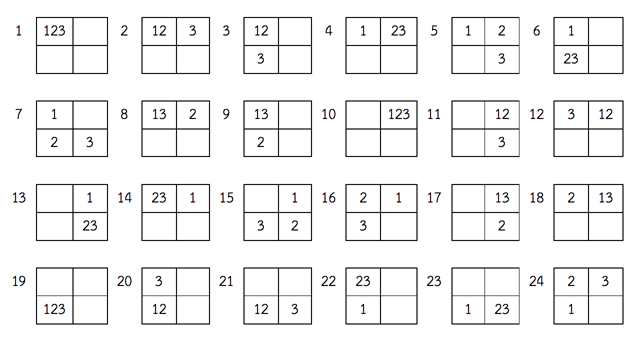
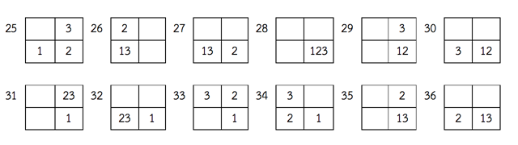

## 문제

ิกเกอร์ (Tigger)เป็นสิ่งมีชีวิตที่รักการกระโดดเด้งดึ๋งมากๆ ในวันนี้ทิกเกอร์จะมากระโดดเด้งดึ๋งในทุ่งหญ้ารูปสี่เหลี่ยมมุมฉากขนาดกว้าง R หน่วย ยาว C หน่วย

การกระโดดของทิกเกอร์นั้นจะสามารถกระโดดไปยังช่องที่อยู่ติดกันในสี่ทิศทาง ได้แก่ ช่องด้านบน, ช่องด้านล่าง, ช่องด้านซ้าย และ ช่องด้านขวา หรือ ทิกเกอร์จะกระโดดซ้ําอยู่ช่องเดิมก็ได้ แต่ทิกเกอร์จะไม่สามารถกระโดดออกจากทุ่งหญ้าได้ เมื่อทิกเกอร์กระโดดจนครบ K ก้าวก็จะถือว่าเสร็จสิ้นภารกิจการกระโดดเด้งดึ๋งในวันนี้

จงเขียนโปรแกรมเพื่อหาจํานวนวิธีในการกระโดดเด้งดึ๋งของทิกเกอร์ โดยตอบเป็นเศษจากการหารด้วย P

## 입력

บรรทัดแรก รับจํานวนเต็มบวก Q แทนจํานวนคําถาม โดยที่ Q มีค่าไม่เกิน 10 อีก Q บรรทัดต่อมา แต่ละบรรทัดรับจํานวนเต็มบวก R C K P ตามลําดับห่างกันด้วยหนึ่งช่องว่าง

โดยที่ 1 <= R, C <= 20 และ 1 <= K <= 1,000 และ 1 <= P <= 1,000,000

## 출력

มีทั้งสิ้น Q บรรทัด แต่ละบรรทัดให้แสดงจํานวนวิธีในการกระโดดเด้งดึ๋งของทิกเกอร์ โดยตอบเป็นเศษจากการหารด้วยจํานวนเต็มบวก

## 힌트

จาก R=2, C=2, K=3 จะได้ว่า ทุ่งหญ้ากว้าง 2 หน่วย ยาว 2 หน่วย และทิกเกอร์จะต้องกระโดดเด้งดึ๋งเป็นจํานวน 3 ก้าว โดยทิกเกอร์จะสามารถกระโดดเด้งดึ๋งได้ทั้งสิ้น 36 วิธี ดังนี้

