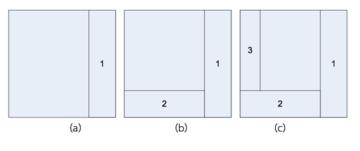
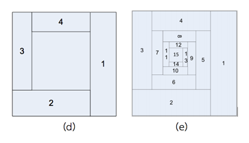

## 문제

ีสี่เหลี่ยมจตุรัสรูปหนึ่งขนาด 80x80 ตร.ม. โดยมีพิกัดของมุมของรูปสี่เหลี่ยมนี้เริ่มจากมุมล่างซ้ายวนแบบทวนเข็มนาฬิกา อยู่ที่ (0,0) (80,0) (80,80) และ (0,80) ต้องการแบ่งพื้นที่ย่อยภายในรูปสี่เหลี่ยมรูปนี้โดยมีหลักการคือ

1. แบ่งพื้นที่สี่เหลี่ยมจตุรัสที่ได้โดยใช้เส้นตรงในแนวตั้งให้เป็นสี่เหลี่ยม 2 รูปที่มีอัตราส่วนพื้นที่ 3:1 แล้วใส่หมายเลขให้สี่เหลี่ยมรูปเล็กเป็น 1 ดังรูป (a)
2. แบ่งพื้นที่สี่เหลี่ยมรูปใหญ่ที่ได้จากการแบ่งในข้อ 1 โดยใช้เส้นตรงในแนวนอนให้สี่เหลี่ยม 2 รูปที่มีอัตราส่วนพื้นที่ 3:1 แล้วใส่หมายเลขให้สี่เหลี่ยมรูปเล็กเป็นเลขถัดไปดังรูป (b)
3. แบ่งพื้นที่สี่เหลี่ยมรูปใหญ่ที่ได้จากการแบ่งในข้อ 2 โดยใช้เส้นตรงในแนวตั้งให้สี่เหลี่ยม 2 รูปที่มีอัตราส่วนพื้นที่ 3:1 แล้วใส่หมายเลขให้สี่เหลี่ยมรูปเล็กเป็นถัดไปดังรูป (c)
4. แบ่งพื้นที่สี่เหลี่ยมรูปใหญ่ที่ได้จากการแบ่งในข้อ 3 โดยใช้เส้นตรงในแนวนอนให้สี่เหลี่ยม 2 รูปที่มีอัตราส่วนพื้นที่ 3:1 แล้วใส่หมายเลขให้สี่เหลี่ยมรูปเล็กเป็นถัดไปดังรูป (d)
5. ทําข้อ 1-4 ซ้ําไปเรื่อยๆ จนกระทั่งแบ่งสี่เหลี่ยมได้15 รูป ดังรูป (e)

หลังจากแบ่งรูปสี่เหลี่ยมได้ 15 รูปแล้ว เขียนโปรแกรมเพื่อ ถ้าให้พิกัด (x,y) หาว่าพิกัดอยู่ในรูปสี่เหลี่ยมรูปใด

## 입력

ตัวเลข n (1<= n <= 100) ในบรรทัดแรกเป็นจํานวนพิกัดที่จะทดสอบ หลังจากนั้น n พิกัด (x,y) จะถูกป้อน(0 <= x, y <= 80) (กําหนดให้พิกัด (x,y) นี้ไม่อยู่บนเส้นตรงที่ใช้แบ่งพื้นที่)

## 출력

หมายเลขของสี่เหลี่ยมที่ได้จากการแบ่งพื้นที่ ที่จุด (x,y) อยู่ภายใน
