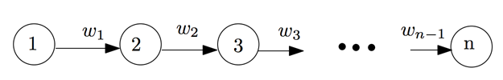

## 문제

Given a directed graph where edges have positive or negative weight as shown in figure, there is a segment where the sum of weights is maximal. For example the graph has three nodes. The weight of edge between node1-node2 and node2-node3 are (w1=-1 and w2=6)

-1 6

Then, the maximum sum weight is between node 2 and node 3 (maximal sum is 6).

Another example is the graph of 6 nodes whose weights are (w1=1 w2=-2 w3=1 w4=6 w5=-3)

1 -2 1 6 -3

The maximum sum weight is between node 3 and node 5 (maximal sum is 7).

Your task is to write a program to find the path containing the maximal sum weight of a given directed graph.

## 입력

The first line of input is n (1 <= n <= 100) the number of test cases. For each test case, the first number r (2 <= r <= 50) indicates the number of nodes in that test case. Then r-1 lines follow. Each line i shows an integer (positive or negative) wi representing the weight between node i and i+1.

## 출력

For each test case, your program should show the beginning node i and the ending node j that yields the maximal sum of weights. If more than one path yields maximal sum, choose the one with the longest path (largest j-i). If there are two paths with the maximal sum and same length, choose the one with the smallest i. If the maximal sum is not positive, your program should display "no good path".
