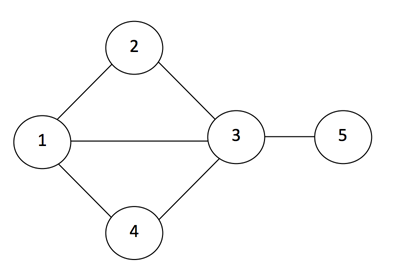

## 문제

หนึ่ง สอง สาม สี่และห้า เป็นเพื่อนกัน เมื่อฤดูกาลทอดกฐินใกล้เข้ามา คุณสองจะเป็นคนใจบุญมากที่สุดและจะเป็นคนแจกซองกฐินให้เพื่อนๆ เสมอ แต่สองต้องการวางแผนการเดินทางไปแจกด้วยตนเองให้มากที่สุดเนื่องจากสภาพการจราจรอยู่ในช่วงซ่อมบํารุงบ่อยๆ ทําให้เส้นทางการเชื่อมต่อจากแต่ละบ้านมีอุปสรรคไม่สามารถเดินทางเชื่อมกันได้ทุกบ้าน ระยะทางไม่ใช่ประเด็นสําคัญสําหรับสอง เขาต้องการเดินทางหาเพื่อนให้มากที่สุดเท่าที่จะทําได้โดยผ่านบ้านเพื่อนแต่ละคนแค่ครั้งเดียวและไม่คิดจะผ่านบ้านหลังเดิมถึงสองครั้งในรอบการเดินทางหนึ่งรอบรวมทั้งบ้านของเขาด้วยถ้ากลับมาถึงบ้านตนเองแล้วสองจะสิ้นสุดการเดินทางในรอบนั้น

ให้เขียนโปรแกรมช่วยสองวางแผนการเดินทางโดยแสดงวิธีการเดินทางจากบ้านของสองไปยังบ้านอื่นๆให้มากที่สุดเท่าที่จะทําได้และแสดงเส้นทางการเดินทางที่เป็นไปได้ทั้งหมด ตัวอย่างเส้นทางของฤดูกาลทอดกฐินปีที่ผ่านมา

จากรูปจะเห็นว่าสองสามารถเดินทางเป็นเส้นทาง 2-1-2, 2-3-2, 2-1-3-2, 2-3-1-2, 2-1-4-3-2, 2-3-4-1-2 และไม่สามารถเดินทาง 2-3-1-4-3-2 เนื่องจากเดินทางผ่าน 3 ถึงสองครั้ง

ให้แสดงลําดับการเดินทางทั้งหมดที่เป็นไปได้เรียงตามลําดับตัวเลขจากน้อยไปหามาก

## 입력

บรรทัดแรกของข้อมูล N เป็นจํานวนเส้นทางเชื่อมต่อทั้งหมดที่เดินทางได้ตามด้วยข้อมูลอีก N คู่บอกว่าเส้นทางนั้นเชื่อมต่อบ้านของใครกับของใคร

## 출력

?
