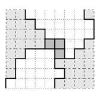

## 문제

In 1997, the programming contest was quickly gaining popularity. For the second time, the Czech Technical University held two programming contests in one year: one for the Faculty of Electrical Engineering (with several guest teams) and, of course, the 1997 CTU Open Contest. By the way, in that year, the winning team of the Charles University then won the Regional Contest and later also the World Finals.

Today you can try to solve one of the problems from 1997, to get an impression.

---

Several years ago, the African tribe of Hooligans dug up a hatchet. The tribe’s military uses advanced technology including machine guns and tanks. Such an equipment gives a huge advantage against the enemy, but it also brings complications during transport. The biggest problem are the numerous rivers and lakes present in the area. Hooligan cartographers invented a precise transformation that maps the landscape in such a way that all boundaries between land and water are either vertical or horizontal and follow precisely the boundaries of unit squares in a square grid. Moreover, the special transformation algorithm causes all rivers to appear to flow vertically (from top to bottom) and all coordinates of the left river boundary are strictly smaller than any coordinate of the right boundary.

Luckily for the ambitious Hooligans, a great inventor named Postolomlatos invented mobile bridges made of easily transportable pieces, called pontoons, precisely of the size of the unit squares of the map. The pontoons can be connected to each other and to the river boundaries only by their whole sides. Due to the economical crisis, the chief Mlask the Great ordered that every river must be crossed by using the minimal number of pontoons needed to build a connected bridge from one side of the river to the other.

See the image with an example of a river with one possible correct solution using three pontoons.

## 입력

The first line of the input contains the number of test cases N. The first line of each test case contains a positive integer K ≤ 10 000 000, which stands for the height of the map. Each of the following K lines describes one horizontal unit strip of the map. Each of these lines contains two space-separated non-negative integers A and B specifying the left and the right coordinates of the river boundary in that strip. It will always hold that A < B ≤ 1 000 000.

## 출력

For each test case, print exactly one line containing the text “K prechodu reky je treba X pontonu.”, where X is the smallest number of pontoons needed to build a bridge from one side of the river to the other.
