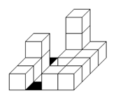
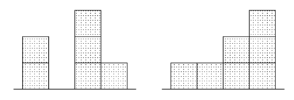
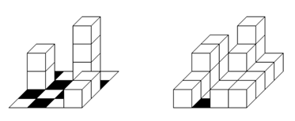

## 문제

1998 was the first year when the Central Europe Regional Contest was held in Prague, at the Czech Technical University. This meant having three programming contests in one year. It was also the year when a new evaluation system (PCSS 3) was implemented from scratch. This piece of software then served with only small improvements (and bug fixes) for the next 14 years, until 2011. Can you imagine that? In 1998, a typical contest had 20 teams and 6 problems. Our best computer had 64MB of memory, so PCSS had to impose many limits on data structures. In contrast, there were about 100 teams and 11 problems in 2011, so you can imagine many of the mentioned limits were exceeded several times during those 14 years.

Now you have a unique opportunity to visit the past and try to solve one of the 1998 problems.

---

Little Matthew always wanted to be an architect and since his childhood he was spending all his free time building architectonic masterpieces. Due to his limited resources, he built his buildings from wooden unit cubes that he put on top of each other. The columns of the cubes were always placed on a checkerboard with K × K unit squares. Matthew always placed the cubes so that every column covered exactly one checkerboard square.

In the following picture, you can admire one of his creations on a board of size 4 × 4.

Little Matthew always wanted to be an architect and since his childhood he was spending all his free time building architectonic masterpieces. Due to his limited resources, he built his buildings from wooden unit cubes that he put on top of each other. The columns of the cubes were always placed on a checkerboard with K × K unit squares. Matthew always placed the cubes so that every column covered exactly one checkerboard square.

In the following picture, you can admire one of his creations on a board of size 4 × 4.

Matthew believed that these drawings will be enough to reconstruct the buildings later. When he grew up, he realized that he had been wrong. Most of his pairs of drawings could depict many different buildings. After some research, he found out that some buildings may be called minimal because they are composed of the minimum number L of cubes among all buildings whose pair of projections match his drawings. Similarly, he called a building maximal if it used the maximal number M of cubes among all possible buildings.

The following are examples of a minimal and a maximal building for the above pair of drawings. They use L = 7 and M = 17 cubes. They are not as perfect as the original building, but they are still worth your attention.

Matthew asked you to write a program that will compute the values L and M for every pair of drawings in his collection.

## 입력

The first line of the input contains the number of test cases N. Each test case is composed of three lines. The first line of each test case contains a positive integer K ≤ 100, which stands for the width and the height of the square board. The second and the third line describe the drawing from the front and from the right, respectively. Every drawing is described by K space-separated non-negative integers (not higher than 100 000) describing the heights of the K columns of the cubes projection, in the left-to-right and front-to-back order.

You can assume that it is always possible to build at least one building for every given pair of drawings.

## 출력

For each test case, print exactly one line containing the sentence “Minimalni budova obsahuje L kostek, maximalni M kostek.”, where L and M are the minimal and the maximal number of cubes in a building represented by the given pair of drawings.
