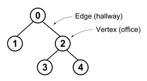

## 문제

Karel wants to register his robot Karel for a robot contest. To do so, he needs to obtain a certificate of safety of his robot, fill in various waivers, etc. He needs to start at the entrance of the building of the contest organizers, visit all prescribed offices in a particular order, and return back to the entrance. Fortunately, the building is easy to navigate, as its hallways do not form any cycles, and thus there is only one path between any two offices. However, Karel would like to know in advance how long it will take to visit all the offices.

Given a building layout and an ordering of all offices v1, v2, . . . , vn, the task is to determine the length of the walk going from v1 to v2, then from v2 to v3, . . . , and finally from vn back to v1.

---

This sounds like a nice contest problem, doesn’t it? We want to give you an idea what it is like to organize a programming contest. If you want to organize one (please contact us after this contest if you really do), writing the textual problem statement and sample solutions is not enough. We also need to prepare the test data that will be used to verify the correctness of submissions. Beside others, we want to eliminate inefficient solutions, so we want to generate a permutation of offices that results in the maximal possible walk. Your task is to find it.

For the purpose of this problem, the building is described as a tree with one office in each of its vertices. For those who are not familiar with graph terms, a short informal definition follows: A tree consist of a set of vertices connected by edges (each edge connects two vertices) in such a way that there is exactly one possible path between any two vertices vi and vj. The length of the path is the number of edges that must be traversed when traveling from vi to vj and it is denoted dist(vi, vj).

## 입력

The input contains several test cases. The first line of each test case contains an integer N, giving the number of the vertices in a tree (2 ≤ N ≤ 10 000). The vertices are numbered from 0 to N − 1. The i-th of the following N − 1 lines contains an integer fi (0 ≤ fi < i), indicating that the tree contains an edge between vertices i and fi.

There is one empty line after each test case.

## 출력

For each test case, print a single line containing N integers v1, . . . , vn separated by spaces. Each of the numbers 0, 1, . . . , N − 1 must appear exactly once. The sum

\[\sum\_{i=1}^{n=1}{dist(v\_i,v\_{i+1})} + dist(v\_n,v\_1)\]

should be the maximum possible. If there are multiple solutions (as they usually are), you may print any of them.
