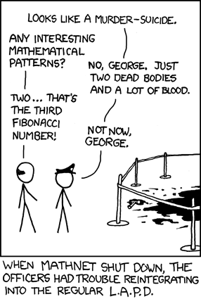

## 문제

피보나치 수열의 매력에 빠진 현욱이는 피보나치 수열을 너무나도 사랑한 나머지 '피보나치 문제해결전략' 책을 사서 읽다가 Gabonacci 수열의 존재에 대해 알게 된다.

당연히 피보나치 수열에 대해서 알고 있을 것이다. 만약 모른다면  [2747번](./002_2747) 문제를 풀어 보는 것을 권장한다. n번째 피보나치 항을 Fn이라 할 때 F1 = 1, F2 = 2이며, 그 이후의 항들은 모두 바로 전 2개 항의 합이다. 이러한 귀납적 정의에 따라 피보나치 수열은 1, 1, 2, 3, 5, 8, 13, . . .. 으로 이어진다.

이제 이를 좀 더 일반화해 보자. 어떤 수열이 피보나치 수열과 같은 재귀적 정의

    G i = Gi-1 + Gi-2 for i > 2

를 따르지만, 처음 두 항을 G 1 ≤ G2 를 만족하게 하면서 임의로 설정할 것이다. 이를 Gabonacci 수열이라고 한다. 만약 G1 = 1, G2 = 3이면, 널리 알려진 수열인 Lucas numbers(1, 3, 4, 7, 11, 18, 29, . . ..)를 얻을 수 있다.

적절한 두 개의 첫 항을 골라서, 당신이 원하는 어떤 자연수를 반드시 Gabonacci 수열에서 등장하게 할 수 있다. 예를 들면, n은 1, n-1로 시작하는 Gabonacci 수열에서 등장한다. 그러나 현욱이는 이건 너무 쉽다고 생각했다. 그래서 가능한 한 작은 항으로 시작해 n이 등장하게 하고 싶다.

## 입력

첫 번째 줄에는 테스트 케이스의 개수 T가 주어진다. (T ≤ 100) 두 번째 줄부터 각 테스트 케이스에 대해 나타나게 해야 할 정수 n이 주어진다. (2 ≤ n ≤ 109)

## 출력

각 테스트 케이스마다 한 줄에 두 자연수 a, b를 출력한다. (0 < a ≤ b) G1 = a, G2 = b, 그리고 어떤 자연수 k에 대해 Gk = n 이다. a, b는 가능한 한 제일 작아야 하며, 이는 어떤 자연수 a', b'에 대해서 a', b'로 시작하는 Gabonacci 수열에서 n이 등장하고, b' < b 이거나 b' = b 이고 a' < a 인 a', b' 가 존재하면 안 된다는 뜻이다.
