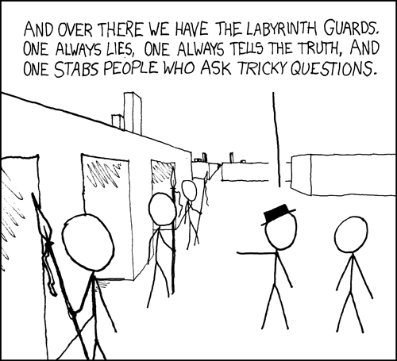

## 문제

What would a programming contest be without a problem featuring an ASCII-maze? Do not despair: one of the judges has designed such a problem.

The problem is about a maze that has exactly one entrance/exit, contains no cycles and has no empty space that is completely enclosed by walls. A robot is sent in to explore the entire maze. The robot always faces the direction it travels in. At every step, the robot will try to turn right. If there is a wall there, it will attempt to go forward instead. If that is not possible, it will try to turn left. If all three directions are unavailable, it will turn back.

The challenge for the contestants is to write a program that describes the path of the robot, starting from the entrance/exit square until it finally comes back to it. The movements are described by a single letter: ‘F’ means forward, ‘L’ is left, ‘R’ is right and ‘B’ stands for backward. Each of ‘L’, ‘R’ and ‘B’ does not only describe the change in orientation of the robot, but also the advancement of one square in that direction. The robot’s initial direction is East. In addition, the path of the robot always ends at the entrance/exit square.

The judge responsible for the problem had completed all the samples and testdata, when disaster struck: the input file got deleted and there is no way to recover it! Fortunately the output and the samples are still there. Can you reconstruct the input from the output? For your convenience, he has manually added the number of test cases to both the sample output and the testdata output.

## 입력

On the first line one positive number: the number of test cases. After that per test case:

* one line with a single string: the movements of the robot through the maze.

## 출력

On the first line one positive number: the number of test cases, at most 100. After that per test case:

* one line with two space-separated integers h and w (3 ≤ h, w ≤ 100): the height and width of the maze, respectively.
* h lines, each with w characters, describing the maze: a ‘#’ indicates a wall and a ‘.’ represents an empty square.

The entire contour of the maze consists of walls, with the exception of one square on the left: this is the entrance. The maze contains no cycles (i.e. paths that would lead the robot back to a square it had left in another direction) and no empty squares that cannot be reached from the entrance. Every row or column – with the exception of the top row, bottom row and right column – contains at least one empty square.
