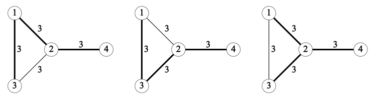
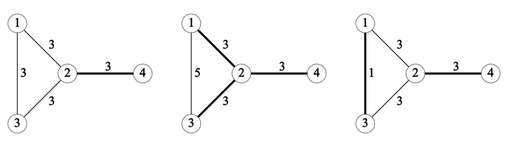

## 문제

ICPC (Isles of Coral Park City) consist of several beautiful islands.

The citizens requested construction of bridges between islands to resolve inconveniences of using boats between islands, and they demand that all the islands should be reachable from any other islands via one or more bridges.

The city mayor selected a number of pairs of islands, and ordered a building company to estimate the costs to build bridges between the pairs. With this estimate, the mayor has to decide the set of bridges to build, minimizing the total construction cost.

However, it is difficult for him to select the most cost-efficient set of bridges among those connecting all the islands. For example, three sets of bridges connect all the islands for the Sample Input 1. The bridges in each set are expressed by bold edges in Figure F.1.



Figure F.1. Three sets of bridges connecting all the islands for Sample Input 1

As the first step, he decided to build only those bridges which are contained in all the sets of bridges to connect all the islands and minimize the cost. We refer to such bridges as no alternative bridges. In Figure F.2, no alternative bridges are drawn as thick edges for the Sample Input 1, 2 and 3.



Figure F.2. No alternative bridges for Sample Input 1, 2 and 3

Write a program that advises the mayor which bridges are no alternative bridges for the given input.

## 입력

The input consists of a single test case.

```

N M
S1 D1 C1
.
.
.
SM DM CM
```

The first line contains two positive integers N and M. N represents the number of islands and each island is identified by an integer 1 through N. M represents the number of the pairs of islands between which a bridge may be built.

Each line of the next M lines contains three integers Si , Di and Ci (1 ≤ i ≤ M) which represent that it will cost Ci to build the bridge between islands Si and Di. You may assume 3 ≤ N ≤ 500, N − 1 ≤ M ≤ min(50000, N(N − 1)/2), 1 ≤ Si < Di ≤ N, and 1 ≤ Ci ≤ 10000. No two bridges connect the same pair of two islands, that is, if i ≠ j and Si = Sj , then Di ≠ Dj . If all the candidate bridges are built, all the islands are reachable from any other islands via one or more bridges.

## 출력

Output two integers, which mean the number of no alternative bridges and the sum of their construction cost, separated by a space.
