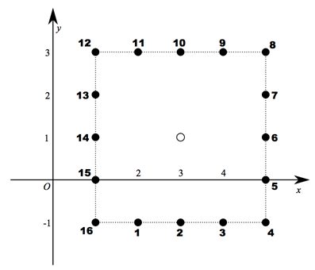

## 문제

Given two points (p, q) and (p′, q′) in the XY-plane, the L∞ distance between them is defined as max(|p − p′|, |q − q′|). In this problem, you are given four integers n, d, s, t. Suppose that you are initially standing at point (0, 0) and you need to move to point (s, t). For this purpose, you perform jumps exactly n times. In each jump, you must move exactly d in the L∞ distance measure. In addition, the point you reach by a jump must be a lattice point in the XY-plane. That is, when you are standing at point (p, q), you can move to a new point (p′, q′) by a single jump if p′ and q′ are integers and max(|p − p′|, |q − q′|) = d holds.

Note that you cannot stop jumping even if you reach the destination point (s, t) before you perform the jumps n times.

To make the problem more e interesting, suppose that some cost occurs for each jump. You are given 2n additional integers x1, y1, x2, y2, ... , xn, yn such that max(|xi|, |yi|) = d holds for each 1 ≤ i ≤ n. The cost of the i-th (1-indexed) jump is defined as follows: Let (p, q) be a point at which you are standing before the i-th jump. Consider a set of lattice points that you can jump to. Note that this set consists of all the lattice points on the edge of a certain square. We assign integer 1 to point (p + xi , q + yi). Then, we assign integers 2, 3, ... , 8d to the remaining points in the set in the counter-clockwise order. (Here, assume that the right direction is positive in the x-axis and the upper direction is positive in the y-axis.) These integers represent the costs when you perform a jump to these points.

For example, Figure K.1 illustrates the points reachable by your i-th jump when d = 2 and you are at (3, 1). The numbers represent the costs for xi = −1 and yi = −2.

Compute and output the minimum required sum of the costs for the objective.



Figure K.1. Reachable points and their costs

## 입력

The input consists of a single test case.

```

n d s t
x1 y1
x2 y2
.
.
.
xn yn
```

The first line contains four integers. n (1 ≤ n ≤ 40) is the number of jumps to perform. d (1 ≤ d ≤ 1010) is the L∞ distance which you must move by a single jump. s and t (|s|, |t| ≤ nd) are the x and y coordinates of the destination point. It is guaranteed that there is at least one way to reach the destination point by performing n jumps.

Each of the following n lines contains two integers, xi and yi with max(|xi|, |yi|) = d.

## 출력

Output the minimum required cost to reach the destination point.
