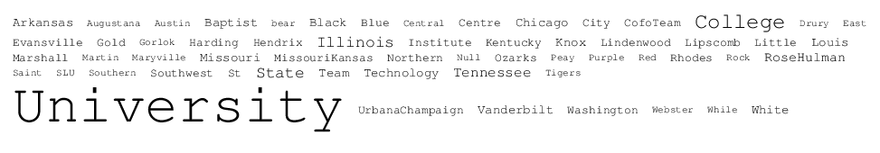

## 문제

A word cloud (or tag cloud) is a visual representation of textual data based on a weighted metric. In the above cloud (which is based on this year's list of Mid-Central teams), the font size of each word is based on its number of occurrences in the data set. Tagg Johnson is a man obsessed with counting words that appear in online documents. On his computer, he keeps a spreadsheet of all the sites he visits, along with a list of words that appear on each site and the number of times such word appears. Tagg would like to generate word clouds based on the data he has collected.

Before describing the algorithm Tagg uses for generating clouds, we digress for a quick lesson in typography. The basic unit of measure is known as a *point* (typically abbreviated as *pt*). A font's size is described based on the vertical number of points from one line to the next, including any interline spacing. For example, with a 12pt font, the vertical space from the top of one character to the top of a character below it is 12 points. We assume that a character's height is precisely equal to the font's point size (regardless of whether the character is upper or lower case).

For this problem, we focus on a fixed-width font, such as Courier, in which each character of the alphabet is also given the same amount of width. The character width for such a font depends on the font size and the aspect ratio. For Courier, a word with *t* characters rendered in a font of size *P* has a total width of \(\left\lceil \frac{9}{16} \cdot t \cdot P \right\rceil\) when measured in points. Note well the use of the ceiling operator, which converts any noninteger to the next highest integer. For example, a 5-letter word in a 20pt font would be rendered with a height of 20 points and a width equal to \(\left\lceil \frac{900}{16} \right\rceil = \left\lceil 56.25 \right\rceil = 57\) points.

Now we can describe Tagg's algorithm for creating a word cloud. He pre-sorts his word list into alphabetical order and removes words that do not occur at least five times. For each word *w*, he computes a point size based on the formula \(P = 8 + \left\lceil \frac{40(c\_w - 4)}{(c\_{max}-4)} \right\rceil\), where \(c\_w\) is the number of occurrences of the word, and \(c\_{max}\) is the number of occurrences of the most frequent word in the data set. Note that by this formula, every word will be rendered with anywhere from a 9pt font to a 48pt font. He then places the words in rows, with a 10pt horizontal space between adjacent words, placing as many words as fit in the row, subject to a maximum width *W* for his entire cloud. The height of a given row is equal to the *maximum* font size of any word rendered in that row.

As a tangible example, consider the following data set and word cloud.

|  |  |  |  |  |
| --- | --- | --- | --- | --- |
| **word** | **count** |  | fruit cloud | fruit cloud |
| apple | 10 |
| banana | 5 |
| grape | 20 |
| kiwi | 18 |
| orange | 12 |
| strawberry | 10 |
|
|
|
|
|

In this example, `apple` is rendered with 23pt font using width 65pt, `banana` is rendered with 11pt font using width 38pt, and `grape` is rendered with 48pt font and width 135pt. If the overall word cloud is constrained to have width at most 260, those three words fit in a row and the overall height of that row is 48pt (due to `grape`). On the second row `kiwi` is rendered with height 43pt and width 97pt, and `orange` is rendered with height 28pt and width 95pt. A third row has `strawberry` with height 23pt and width 130pt. The overall height of this word cloud is 114pt.

## 입력

Each data set begins with a line containing two integers: *W* and *N*. The value *W* denotes the maximum width of the cloud; *W* ≤ 5000 will be at least as wide as any word at its desired font size. The value 1 ≤ *N* ≤ 100 denotes the number of words that appear in the cloud. Following the first line are *N* additional lines, each having a string *S* that is the word (with no whitespace), and an integer *C* that is a count of the number of occurrences of that word in the original data set, with 5 ≤ *C* ≤ 1000. Words will be given in the same order that they are to be displayed within the cloud.

## 출력

For each data set, output the word `CLOUD` followed by a space, a serial number indicating the data set, a colon, another space, and the integer height of the cloud, measured in font points.
