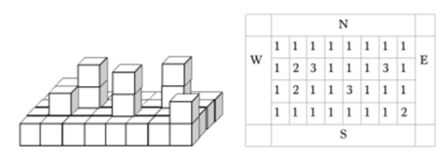
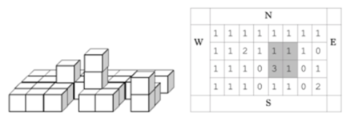

## 문제

The security service of Snakeland wants to destroy the hostile alien ship. The security service has damaged the ship and forced it to land. The ship is built of cubic compartments of unit size. The first layer is always composed of N \* M compartments. The picture (left) shows an example of a ship with size N = 4, M = 8, and (right) a top-view of the ship indicating the number of superimposed compartments.

Compartments are made of ultra-strong metal, so lasers are used to destroy the ship. Laser devices were deployed on each of the four sides of the ship, and they periodically produce beams perpendicular to the sides of the ship, towards different compartments of the ship. Each beam destroys the R first compartments on its way. If other compartments are located on top of destroyed ones, these compartments shift down.

After K shots it was decided to airstrike the ship. It makes sense to choose an area of size P \* P, which contains a maximum number of remaining compartments to destroy them all.

Write a program that calculates maximum number of undivided compartments that can be destroyed by airstrike from an area with size P \* P.

## 입력

The first line from the input contains 5 integers N, M (1 ≤ N \* M ≤ 1 000 000), R (0 < R ≤ 10), K (0 < K ≤ 300 000), P (0 < P ≤ min(N, M, 10)).

The following N lines contain M integers. The integer from the i-th row and j-column defines the number of compartments in the corresponding part of the ship as shown in the picture (right). Each integer is in the range 1..106.

The next K lines describe laser shots. Each of these lines contains one symbol and 2 integers. Symbols define the side of the ship being shot: W, E, S, N. The first integer defines the row number in case of west or east and the column number in case of north or south, the second number indicates the horizontal layer being shot. Rows and columns are numbered as in the input, layers are numbered from 1. Each integer is in the range 1..106.

## 출력

You need to print the maximum number of remaining compartments after K laser shots contained in some area of size P \* P.

## 힌트

On the second picture you can see the state of the ship from the first picture after the shots described in sample input and one of 2\*2 areas with the maximum number of remaining compartments.
