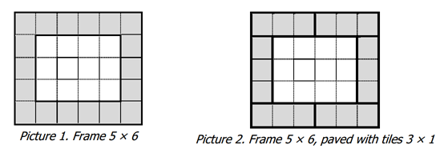

## 문제

Let's consider a X×Y rectangle with the middle (X – 2)×(Y – 2) rectangle cut out. We will call this figure a frame with size X×Y. Picture 1 shows the frame 5 × 6.

Let's assume that we have unlimited number of tiles with size A×1. We consider the following problem: is it possible to completely pave a frame with size X×Y using these tiles (tiles can be rotated by 90 degrees). For example, frame 5×6 from Picture 1 can be paved completely with tiles of size 3×1 (one way to do so is shown in Picture 2), but can’t be paved with tiles of size 4×1.

## 입력

The first input line contains 2 integers – X and Y (3 ≤ X ≤ 106, 3 ≤ Y ≤ 106). The second line contains integer N – the number of tile types to be analyzed (1 ≤ N ≤ 1000). Each of following N lines contains one integer, not exceeding 106. We designate with AK the integer on the (k+2)-th line of the input file.

## 출력

Your goal is to print N lines, where the K-th line should contain the word "YES", if it is possible to tile the frame with size X × Y with tiles AK × 1, and the word "NO" otherwise.
