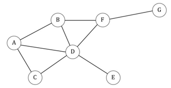

## 문제

Online social networking services such as Facebook, Google+, Instagram, etc. has grown rapidly in the last decade. Nowadays, almost all youngsters, especially those on developed countries, know and use social networking services in their daily life. In this service, user creates account to represent him/her. Depends on the type of the services, each user establishes connections to other users in the same social network service. For example, in Facebook, this connection is called “friend” and it is bidirectional; it means if A is a friend to B, then B is also a friend to A. Meanwhile, in services such as Google+, any connection does not necessary bidirectional. You can “follow” (create connection to) some other users without requiring them to follow you back. In this problem, we regard each connection as bidirectional.

Supposed you have relationship information of N users in a certain social networking services. In how many ways can you choose three users such that those three are strangers to each other? In other words, these three persons do not have any connection to each other. For example, consider relationship information of 7 users as shown in the following figure.

In this example, there are 7 ways to choose three users which are stranger to each other, namely: A-E-F, A-E-G, B-C-E, B-C-G, B-E-G, C-E-F, and C-E-G. If you observe it carefully, user D cannot exists in any of those group-of-three as he has connections to all other users except G, thus any group-of-three will contain at least one user whom D connects to. An invalid example would be A-B-E. Even though A and B does not have any connection to E, but A and B are connected to each other.

Note that two groups are considered different if and only if both groups differ by at least one member.

## 입력

The first line of input contains an integer T (T ≤ 60) denoting the number of cases. Each case begins with two integers N (3 ≤ N ≤ 5,000) and M (0 ≤ M ≤ 20,000) denoting the number of users and connections in the given social networking service. The following M lines each contains two integers A and B (1 ≤ A, B ≤ N; A ≠ B) representing a connection between user A and user B. You may assume that all connections are unique.

## 출력

For each case, output in a line "Case #X: Y" (without quotes) where X is the case number starting from 1, followed by a single space, and Y is in how many ways you can choose three users such that they are stranger to each other.
