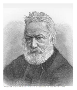

## 문제

A pantun is a traditional form of oral Malay verse. It is believed to have evolved to its most current form in the 15th century, as evidenced by Malay manuscripts. It has been adapted by both French and British writers since the late 19th century. Victor Hugo (picture) is sometimes credited with its introduction to the Western world, where it is called the "pantoum." In its most basic form the pantun consists of a quatrain which employs an abab rhyme scheme. A pantun is traditionally recited according to a fixed rhythm and as a rule of thumb, in order not to deviate from the rhythm, every line should contain between 8 and 12 syllables (a.k.a. syllable count requirement). A pantun is a four-lined verse consisting of alternating, roughly rhyming lines. The first and second lines sometimes appear completely disconnected in meaning from the third and fourth, but there is almost invariably a link of some sort.

Most Malay words has the following syllable structure: 6 and above length of word has 3 syllables, 4 and 5 length of word has 2 syllables, and 3 and less length of word has 1 syllable. However there are two general exceptions: for 6 length of word that contain ‘ng’ or ‘ny’ within the word, it has 2 syllables. For 3 length of word that starts with vowel alphabet, it has 2 syllables. For example: “aku” has 2 syllables, “kau” has 1 syllable, “berlari” has 3 syllables, “belang” has 2 syllables, “si” has 1 syllable and “seorang” has 3 syllables.

Pantun rhythm has the following structure. The last two alphabets of the last word in alternating verses should be the same, i.e. 1st - 3rd verses, and 2nd - 4th verses. For example, consider the following pantun and observe the bold (and underlined) alphabets.

* Dua tiga kucing berla**ri**
* Mana nak sama si kucing bela**ng**
* Dua tiga boleh kau ca**ri**
* Mana nak sama aku seora**ng**

As you can see, the 1st and 3rd verses have a same rhythm (ended with “ri”), while the 2nd and 4th verses also have a same rhythm (ended with “ng”). This is an example of pantun with good rhythm (both pairs rhyme). If we analyze the syllable count of the above pantun, then:

* First verse : 8 syllables (1+2+2+3)
* Second verse : 10 syllables (2+1+2+1+2+2)
* Third verse : 8 syllables (1+2+2+1+2)
* Forth verse : 10 syllables (2+1+2+2+3)

This pantun also has a same number of syllables for each pair of alternating verse, which is also a sign of a good pantun.

As someone who loves pantun, there are so many pantun that you need to assessed. Thus, it is handy to have an automatic pantun early-evaluator (we call it early-evaluator as the result of this evaluator only serves to determine the priority of pantun which should be assessed first).We decided that the evaluator should score the pantun in the following way:

* 10 points for each verse which fulfill the syllable count requirement (maximum of 4 verses).
* 20 points for each pair of alternating verse which fulfill the rhythm requirement (maximum 2 pairs of alternating verses).
* 10 points for each pair of alternating verse which have the same number of syllables (maximum 2 pairs of alternating verses).

The given pantun might have an arbitrary number of verses, but you should only consider the first 4 verses at most. Penalty of 10 points are given for each extra verse. Your task is to build this pantun early-evaluator.

## 입력

First line of input is an integer N that represents the number of test case, followed by N (1 ≤ N ≤ 50) lines where each line of input contains several verses where each verse is separated by a symbol comma, and ended by a symbol period. The total number of alphabet in a pantun will be not more than 255 including symbol comma and period, and the minimum length of word is 2.

## 출력

For each test case, the output contains a line in the format “Case #X: A B C D E” where X is the case number (starting from 1), A is an integer represents the point for syllable structure marks, B is an integer represents the point for rhythm structure marks, C is an integer represents the point for having exactly same number of syllable, D is an integer represents the point for penalty and E represents the overall points (i.e. A + B + C – D).
