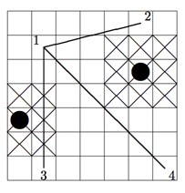

## 문제

Tessa is a high school senior who plays on the soccer team. Her coaches are trying to put an emphasis on passing, and they want to help players learn how to recognize when a teammate is open for a pass. They’ve decided to model the field as a square grid like the one shown below. Each player (for both the offense and the defense) takes up one grid square - the offensive players are indicated with numbers and the defensive players with black circles. Each defensive player also has the ability to move to any neighboring square in order to intercept a pass; the squares that each defender can guard are shown with an X in them. Assume player 1 has the ball. Another player is considered open if the line drawn from the center of that person’s square to the center of player 1’s square does not touch any of the squares that can be reached by a defender. If the line touches a defenders area even at a single point, then the pass could be intercepted. Offensive players never block a pass to other offensive players.

In the above example, Player 1 can pass the ball to Player 2, but not to Players 3 and 4.

Having set up this great model, the coaches suddenly realize that they don’t have any ability to write code to determine who is open and who is isn’t. One of the players has given them your name as a computer whiz, so it’s time to get your game face on, put it all on the line, give 110% and code one for the Gipper.

## 입력

The input file will consist of multiple test cases. Each case starts with four positive integers r c o d indicating the number of rows (r) and columns (c) in the grid and the number of offensive and defensive players (o and d, respectively). Both r and c will be ≤ 50. Following this will be o lines containing two integers giving the row and column location of an offensive player (row and column numbering start at 0). Following this will be d analogous lines for the defenders. The offensive players are numbered 1, 2, 3, . . . in the order that they appear in the input, and offensive player 1 is the one with the ball. No two players will ever be in the same grid square. A line with four zeros will terminate input.

## 출력

For each test case, output the case number followed by a list of all the players that Player 1 can pass the ball to. Output the numbers in increasing order, separated by a single space. Label each test case as shown below.
