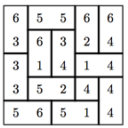

## 문제

Yahtzee is a well known dice game in which players get points for various combinations of five dice rolls. Some of the combinations and their payoffs are shown Table 1 (note: the payoffs for the first two are slightly different than in the official rules of Yahtzee):

| Combination | Description | Points |
| --- | --- | --- |
| 3-of-a-Kind | 3 dice showing same face | Sum of the three dice |
| 4-of-a-Kind | 4 dice showing same face | Sum of the four dice |
| Full House | 3-of-a-Kind and a pair | 25 |
| Small Straight | 4 consecutive values on any 4 dice | 30 |
| Large Straight | 5 consecutive values | 40 |
| Yahtzee | 5 dice showing same face | first Yahtzee - 50  subsequent Yahtzees - 100 each |

Table 1

Domiyahtzee! is a well known version of Yahtzee which we just invented. It uses a standard set of 21 dominoes containing all possible combinations of the numbers 1 through 6 – (1,1), (1,2), ..., (1,6), (2,2), (2,3), ..., (6,6). The game is played as follows: you are given a 5 × 5 grid which is filled with 12 of the 21 dominoes along with a value between 1 and 6 placed in a random square. An example grid is shown below – the “4” in the fourth row and column is the lone “singleton” value:

Figure 1

You score points in Domiyahtzee! for each combination in Table 1 found in any row, column or long diagonal. The grid above would score for the Full House in row 1, the Small Straight in row 4, the 3-of-a-Kind in column 1, the Small Straight in column 3, the 4-of-a-Kind in column 5 and the Full House in the first long diagonal for a total score of 25 + 30 + 9 + 30 + 16 + 25 = 135. However, you can attempt to improve your score by replacing any one domino on the grid with any of the remaining 9 unused dominoes. For example, if you were to replace the (5,5) in the first row with the unused (6,6) domino, the grid would now score 50 (for the Yahtzee in row 1) + 30 + 9 + 18 (for the new 3-of-a-Kind in column 2) + 40 (for the new Large Straight in column 3) + 16 + 25 = 188. The object of the game, of course, is to find the replacement which maximizes your score. In the above example, replacing the (5,6) in row 5 with a (3,2) leads to the highest scoring grid.

## 입력

The input file starts with an integer n indicating the number of test cases in the file. Each test case consists of 13 domino specifications of the form H n1 n2, V n1 n2, or S n1, indicating either a horizontal or vertical domino, or a singleton value (there is exactly 1 singleton in each test case). These specifications may be over multiple lines. As you read in each domino specification you place it in the first available location going row-wise left-to-right, top-to-bottom.

## 출력

For each test case, output the maximum obtainable score for the given grid of dominoes involving at most one domino replacement.

## 힌트

**Freetime Challenge!**

What’s the highest scoring Domiyahtzee grid that you can make? Our highest scoring grid is worth 498 points.
