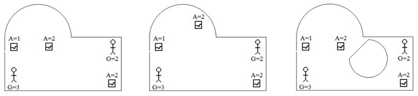
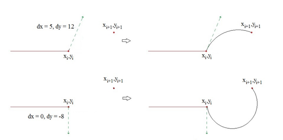

## 문제

Lou Va is the curator of a world-renowned art museum. While he has hundreds of pieces of artwork on display, there are certain ones that are extremely valuable and need extra levels of security. Lou has set up a collection of security locations throughout the museum and plans to place security guards there to keep an eye on the valuable art.

After careful analysis of the art pieces and the security guards’ resumes, Lou has assigned different levels to each art piece and each guard. A level n art piece is one which must be in view of at least n security guards. A level m security guard is one who has enough experience to keep an eye on up to m pieces of art. Lou wants to place the guards so that each piece of art can be watched by the appropriate number of guards.

One more complication: this is a modern-art musuem, and its layout is non-conventional. Walls of all the rooms are either straight line segments or arcs of circles. The first two layouts in Figure 1 show one such room, with different placements of guards and art pieces (with their respective level values shown). In addition, there may be one or more interior sets of walls that can block the guards’ views, as shown in the third layout below. Any set of interior walls forms a simple closed loop, and if there is more than one such set of interior walls, none will intersect or nest within each other.

Figure 1

As the second and third examples show, sometimes the placements of the guards is not sufficient to watch all of the art pieces. Lou needs to know this, as he will then change either the placements of the guards or the art pieces. He has come to you for some help.

## 입력

The first line of each test case contains three integers n a g indicating the number of wall sets, art pieces and guards, respectively, where 1 ≤ n and 0 ≤ a, g ≤ 100. Following this are descriptions of each of the n wall sets, where the first set is the set of outer walls. Each description starts with an integer m indicating the number of walls in the wall set. This is followed by m sets of integer coordinates xi yi each followed by either an ‘s’ or a ‘c’. An ‘s’ indicates that point (xi, yi) should be connected by a straight-line wall to the next point, and a ‘c’ indicates it should be connected with a circular arc. Following a ‘c’ are two integers giving the dx and dy values of the tangent line of the circle at the point (xi, yi). Two examples of this are shown in Figure 2.

Figure 2

The total number of walls for all the rooms in any test case will be ≤ 125. Following the wall specifications are a integer coordinates giving the location of the art pieces, each followed by a positive level number. Next are g integer coordinates giving the location of the guards, each followed by a positive level number. No wall corner will lie on a line segment connecting an art piece and a guard, and no line between an art piece and a guard will ever be tangent to a curved wall. All coordinates are in the range -150000 to 150000. A line containing three 0’s will terminate input.

## 출력

For each test case, output the case number and either Yes or No indicating whether or not the guards in their current locations can watch the art pieces at the appropriate levels.
