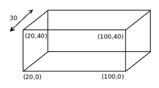

## 문제

You just bought an “artistic” aquarium tank that has an interesting shape, and you poured L litres of water into the tank. How high is the water in the tank?

When you look at this tank from one side, it has the shape of a convex polygon. This polygon has exactly two vertices on the table (y-coordinates are 0), and all other vertices have positive y-coordinates. There are also exactly two vertices with maximum y-coordinates, and water is poured into the opening between these two vertices. This aquarium tank has a depth of D centimetres. The tank is glued to the table, so no matter what shape it has, it keeps its position and does not tip over.

All coordinates and lengths in this problem are given in centimetres. It should be noted that each cubic metre is equivalent to 1 000 litres.

An illustration showing the configuration of the tank of the first sample input is given below:

## 입력

The input consists of a single test case. The first line contains an integer N (4 ≤ N ≤ 100) giving the number of vertices in the polygon. The next line contains two integers D and L, where 1 ≤ D ≤ 1 000 is the depth of the aquarium tank and 0 ≤ L ≤ 2 000 is the number of litres of water to pour into the tank. The next N lines each contains two integers, giving the (x, y) coordinates of the vertices of the convex polygon in counterclockwise order. The absolute values of x and y are at most 1 000. You may assume that the tank has a positive capacity, and you never pour more water than the tank can hold.

## 출력

Print the height of the water (in centimetres) in the aquarium tank on a line to 2 decimal places.
