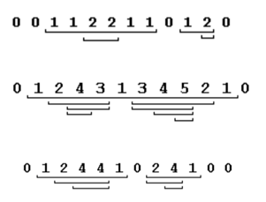

## 문제

n개의 정수 수열 a1, a2, a3, ..., an에 대해, 섬이란 다음 조건을 만족하는 연속된 부분수열을 말한다.

* 섬의 모든 수는 부분수열이 시작하기 직전 수보다 크다.
* 섬의 모든 수는 부분수열이 끝난 직후의 수보다 크다.

아래의 예시에는 각각의 예제 수열에 대한 모든 섬이 표시되어 있다.

이 문제에서 수열은 항상 12개의 음이 아닌 정수로 이루어져 있다.

이때, 총 섬의 개수를 출력하라.

## 입력

첫 줄에 테스트 케이스의 수 P가 주어진다. (1 ≤ P ≤ 1000)

각 테스트 케이스는 테스트 케이스의 번호 T와 12개의 음이 아닌 정수로 이루어져 있다. 또한, 12개의 정수 중 첫 수와 마지막 수는 항상 0이다.

## 출력

각 테스트 케이스마다 테스트 케이스의 번호와 섬의 수를 공백으로 구분하여 출력한다.
