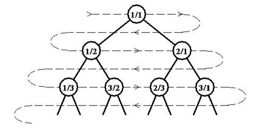

## 문제

무한 유리수 트리는 완전 이진 트리이며, 다음과 같이 정의된다.

* 루트는 1/1이다.
* p/q의 왼쪽 자식은 p/(p+q)이다.
* p/q의 오른쪽 자식은 (p+q)/q이다.

트리의 첫 세 층은 아래와 같이 구성된다.

이 무한 유리수 트리를 레벨 오더로(그림에서는 화살표 방향) 순회하여 얻어지는 수들을 나열하면 유리수 수열 F(n)을 얻을 수 있다. 첫 몇 개의 항은 아래와 같다.

F(1) = 1/1, F(2) = 1/2, F(3) = 2/1, F(4) = 1/3, F(5) = 3/2, F(6) = 2/3, …

입력으로 기약분수 p/q가 주어지면 F(n)에서 주어진 유리수의 다음 수가 무엇인지 찾는 프로그램을 작성하여라.

즉, F(n)=p/q일 때 F(n+1)을 찾으면 된다.

## 입력

첫 줄에 테스트 케이스의 수 P가 주어진다. (1 ≤ P ≤ 1000)

각 테스트 케이스마다 테스트 케이스의 번호와 기약분수 하나가 공백으로 구분되어 주어진다.

기약분수는 항상 p/q꼴이며 공백은 주어지지 않는다. p는 분수의 분자이며 q는 분모이다.

모든 테스트 케이스에서 p와 q는 서로소이며, 0 ≤ p, q ≤ 2147483647을 만족한다.

## 출력

각 테스트 케이스마다 첫 줄에 테스트 케이스의 번호와 정답을 공백으로 구분하여 출력한다.

답이 되는 기약분수는 입력 형식과 동일하게 분자/분모 형태로 출력하며, 사이에 공백을 두어선 안 된다.

모든 테스트 케이스에서 답이 되는 분수의 분자와 분모는 32bit 정수 범위를 넘지 않는다.
