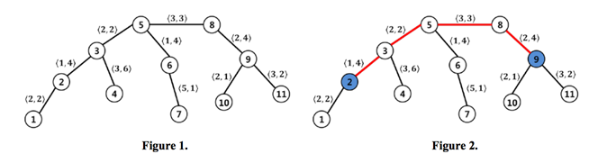

## 문제

In a city, there is a huge network of roads, each of which connects two districts. The network seems like a tree, in other words, for two arbitrary districts, there is exactly one path between them. Here, the path is a sequence of roads on which we can travel from one district to the other.

Many cars pass roads in the network day after day and so the roads are damaged seriously. The city department of transportation repairs roads regularly. Each road R has a cost c and a benefit b. We can repair the road R with the cost c and obtain the (social) benefit b when R is repaired.

Repairing all the roads belonging to a path, the cost and benefit of the path are the total cost and benefit of its roads, respectively. Given an upper bound of cost C, you should find a path in the network that maximizes its benefit while having a cost of at most C.

For example, a network is given in Figure 1. The circles and the solid lines represent districts and roads, respectively. The pair of integers <c, b> on a road describes that the road has the cost c and the benefit b. In this example, if the bound of cost is 8, then the red path given in Figure 2 has the benefit 13 with the cost 8 and it maximizes the benefit.

## 입력

Your program is to read from standard input. The input consists of T test cases. The number of test cases T is given in the first line of the input. Each test case starts with an integer n, the number of districts in the network, where 2 ≤ n ≤ 22,000. The districts are numbered from 1 to n. There are always exactly n − 1 roads in the network. Each of the following n − 1 lines contains four integers α, β, c and b, representing that the road connecting districts α and β has the cost c and the benefit b. Here, 1 ≤ α,β ≤ n and 1 ≤ c, b ≤ 1,000. Finally, the last line contains an integer C to represent the upper bound of cost, where 1 ≤ C ≤ 2 × 107.

## 출력

Your program is to write to standard output. Print exactly one line for each test case. The line should contain an integer to represent the maximum benefit which a path can obtain, while having a cost of at most C. If such a path never exists, then the line contains 0.
