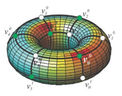
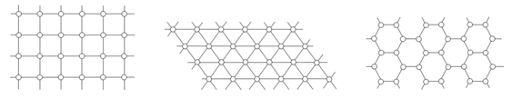
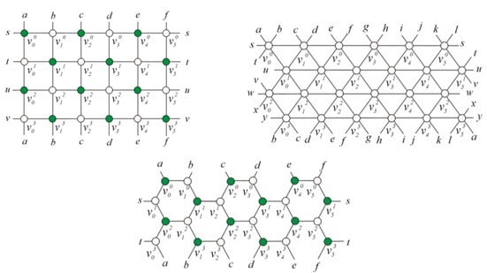

## 문제

As is well known, a regular polygon is a polygon having all sides of the same length and all equal angles. A regular tiling of the Euclidean plane is a covering of the entire plane with non-overlapping, identical regular polygons, in which the polygons are placed vertex-to-vertex. There exist only three types of polygons that admit a regular tiling: square, equilateral triangle and regular hexagon. A lattice is an infinite graph whose drawing on the plane forms a regular tiling. In Figure 1, three lattices are illustrated: square lattice, triangular lattice, and hexagonal lattice (from left to right).

Figure 1. The square, triangular and hexagonal lattices.

One day, Heechul, an eminent researcher in the community of graph theory, discovered the interesting fact that such lattices can be converted into finite graphs (graphs with finite numbers of vertices and edges), conveying their inherent characteristics, e.g. the beautiful symmetrical structures. In particular, the finite graphs allow effective drawings on the surface of a torus without edge crossings, also resulting in the tiles (i.e., the regions bounded by the minimum-length cycles) that are very similar in their shapes and sizes. So, he delightedly called such drawings toroidal lattices, which are now defined as follows (refer to Figure 2):

**Definition 1**. For two integers m, n ≥ 3, the m × n toroidal square lattice is a graph whose vertex set is {vji ∶ 0 ≤ i ≤ m − 1, 0 ≤ j ≤ n − 1} and edge set is {(vji, vj′i′) ∶ (i′ = i and j′ ≡ j + 1 (mod n)) or (j′ = j and i′ ≡ i + 1 (mod m))}.

**Definition 2**. For two integers m, n ≥ 3 with m even, the m × n toroidal triangular lattice is the graph constructed from the m × n toroidal square lattice by adding edges of E0 ∪ E1 ∪ ⋯ ∪ Em−1, where

Ei =

* {(vji, vj′i′) ∶ i′ ≡ i + 1 (mod m) and j′ ≡ j − 1 (mod n)} if i is even,
* {(vji, vj′i′) ∶ i′ ≡ i + 1 (mod m) and j′ ≡ j + 1 (mod n)} if i is odd.

**Definition 3**. For two integers m, n ≥ 4 with both even, the m × n toroidal hexagonal lattice is the graph whose vertex and edge sets are {vji ∶ 0 ≤ i ≤ m − 1, 0 ≤ j ≤ n − 1} and {(vji, vj′i′) ∶ (j′ = j and i′ ≡ i + 1 (mod m)) or (i′ = i and j′ ≡ j + 1 (mod n) and i + j ≡ 0 (mod 2))}, respectively.

To celebrate the 60th birthday of Heechul, a project was initiated by his colleagues to build a C/C++ library for lattice-related graph algorithms. In order to help them, you are going to write a program that, given an m × n toroidal lattice, finds a cycle that visits every vertex exactly once. (Note that a cycle of a graph is represented as a sequence (u1, u2, … , umn) of mn distinct vertices such that uk and uk+1 are adjacent in the graph for all  k ∈ {1, … , mn − 1} and moreover, umn and u1 are also adjacent.) Since the toroidal square lattice is rather simple, we will only consider the toroidal triangular/hexagonal lattices in this coding.

Figure 2. The 4 × 6 toroidal square, triangular and hexagonal lattices.

## 입력

Your program is to read from standard input. The input consists of T test cases. The number of test cases T is given in the first line of the input. Then, T lines are followed, where each line contains three integers, m, n and p, where 3 ≤ m, n ≤ 111 and p ∈ {3, 6}, indicating that the corresponding input graph is an m × n toroidal lattice of type triangular (if p = 3) or hexagonal (if p = 6). You are always given a well-defined toroidal lattice.

## 출력

Your program is to write to standard output. The output consists of the results for the T test cases in the given order. For each test case, the first line must contain an integer indicating whether there exists a feasible solution. If yes, the integer must be 1; otherwise -1. When and only when the first line is 1, it must be followed by mn lines, describing the sequence of vertices of the found cycle, where the index of vertex vji is to be output as (i,j). In case multiple solutions are possible, just output any one of them. No whitespace characters (blanks and/or tabs) are allowed inside a line.
