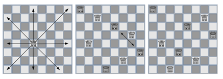

## 문제

체스에서 여왕은 강력한 말이다. 여왕은 가로, 세로, 그리고 대각선으로 제한없이 이동하여 상대를 공격할 수 있다.

사이나쁜 여왕 퀴즈는 여덟 여왕을 8x8 체스판 위에 배치하는데, 아무도 서로 공격할 수 없도록 배치하는 퀴즈다. 가운데 그림은 올바르지 않은 풀이인데, 두 여왕이 대각선을 통해서 서로 공격할 수 있기 때문이다. 오른쪽 그림은 올바른 해법이다. 우리는 체스판과 여왕의 배치가 주어질 때 해당 배치가 올바른 사이나쁜 여왕 퀴즈의 해법인지 아닌지를 판단해야 한다.

## 입력

입력은 하나의 체스판을 8줄에 걸쳐 줄마다 8개의 문자로 나타낸다.

각 문자는 '.' 혹은 '\*' 이며 '.'은 빈 칸을, '\*'은 여왕이 있음을 나타낸다.

## 출력

한 줄에 걸쳐 올바른 해법일 경우 "valid", 올바르지 않은 해법일 경우 "invalid"를 출력한다.
