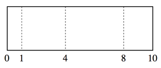

## 문제

골룸산업은 유연하고 재배치가 가능한 최신 트렌드의 오피스 공간을 디자인하고 있다. 새로이 만드는 공간은 가로로 긴 직사각형 형태의 오피스와 군데군데 선택해 배치할 수 있는 세로 파티션으로 구성되어 있다.

그림 C.1

그림 C.1 은 폭이 10이고 1, 4, 8 자리에 선택적으로 파티션을 배치할 수 있는 오피스를 나타내고 있다. 방의 폭은 언제나 왼쪽과 오른쪽 벽 사이의 거리로 나타내어지며, 파티션은 언제나 왼쪽과 오른쪽 벽에 평행하게 놓여진다.

위 예제에서 아무런 파티션도 선택하지 않는 경우, 우리는 폭 10의 미팅공간을 확보할 수 있다. 만약 회사가 폭 4의 미팅 공간을 필요로 한다면 위치 4에 파티션을 하나 배치함으로써(혹은 4 와 8 자리에 파티션을 하나씩 배치함으로써) 폭 4의 미팅공간을 확보할 수 있다. 폭 7의 미팅공간을 확보하기 위해서는 위치 1과 8에(가운데 4를 제외하고) 파티션을 배치하면 된다.

디자인한 방의 정보가 주어질 때, 해당 방에서 만들 수 있는 가능한 모든 종류의 방 폭을 알아내어라.

## 입력

입력의 첫 줄은 두 개의 정수로 구성된다: 전체 폭 W(2 <= W <= 100)과 파티션의 개수 P(1 <= P < W). 이어지는 줄에는 P개의 정수가 주어지며, 각각의 정수 L(0 < L < W)은 해당 위치에 파티션을 설치할 수도 있음을 나타낸다. 각각의 파티션의 위치는 서로 다르며 증가수열 형태로 주어진다.

## 출력

구성가능한 모든 미팅방의 크기를 작은 크기부터 순서대로 출력한다.
