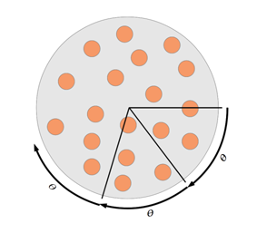

## 문제

You are sharing a large, circular pizza with n − 1 of your friends. Your technique for slicing the pizza is shown in Figure 1; you rotate the pizza clockwise about its center by angle θ, and then you make a slice from the center of the pizza straight to the right. You repeat this process, rotating by the same angle θ and slicing to the right until you have done it a total of n times.

Figure 1: Rotate-and-slice pizza division technique.

Of course, this isn’t really a good way to divide a pizza (unless θ is well-chosen). Some of the resulting slices may be larger than others, and you may not even end up with n different slices. You don’t care so much about fairness. You just want to know how big the largest slice will be, so you can take it for yourself.

## 입력

Input begins with an integer 1 ≤ m ≤ 200 indicating the number of test cases that follow. The following m lines each contain one test case. Each test case gives the pizza radius in centimeters, r, followed by the number of people sharing the pizza, n, followed by the rotation angle, θ. The quantities r, n and θ are all positive. The value r is an integer no greater than 100, and n is an integer no greater than 108. The angle θ is given as an integer number of degrees, followed by an integer number of minutes and an integer number of seconds. Degrees are between 0 and 359 (inclusive), while minutes and seconds are between 0 and 59 (inclusive).

## 출력

For each test case, print the area in square centimeters of the largest resulting slice of pizza. You do not need to worry about the precise formatting of the answer (e.g. number of places past the decimal), but the absolute error of your output must be smaller than 10−4.
